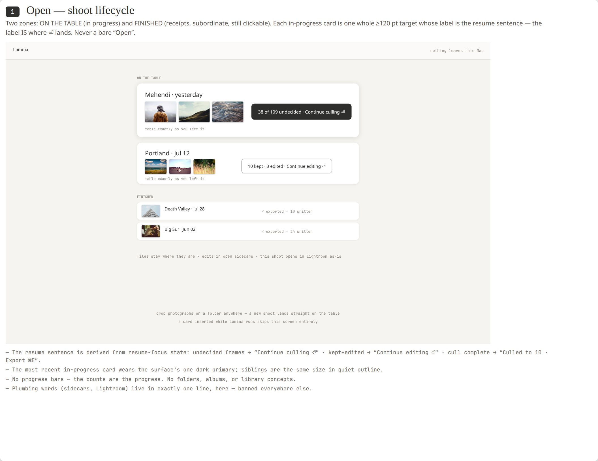
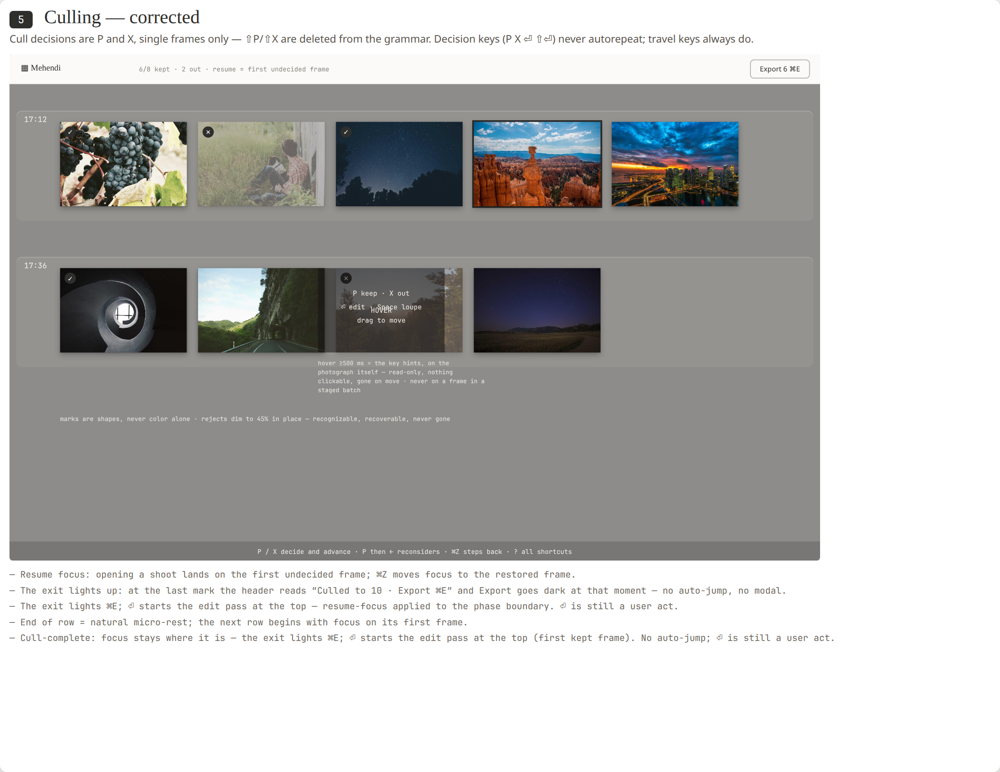
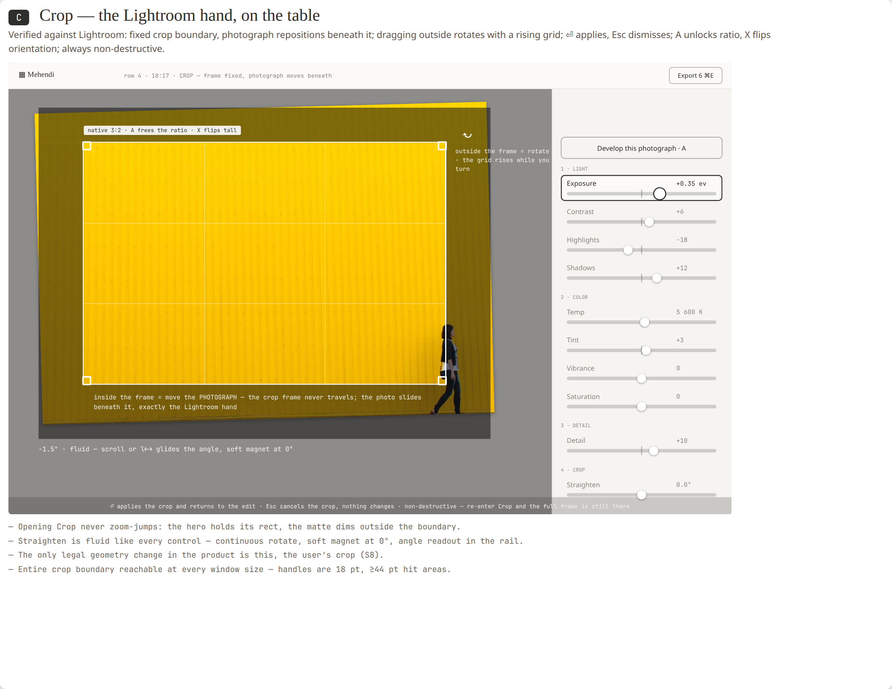
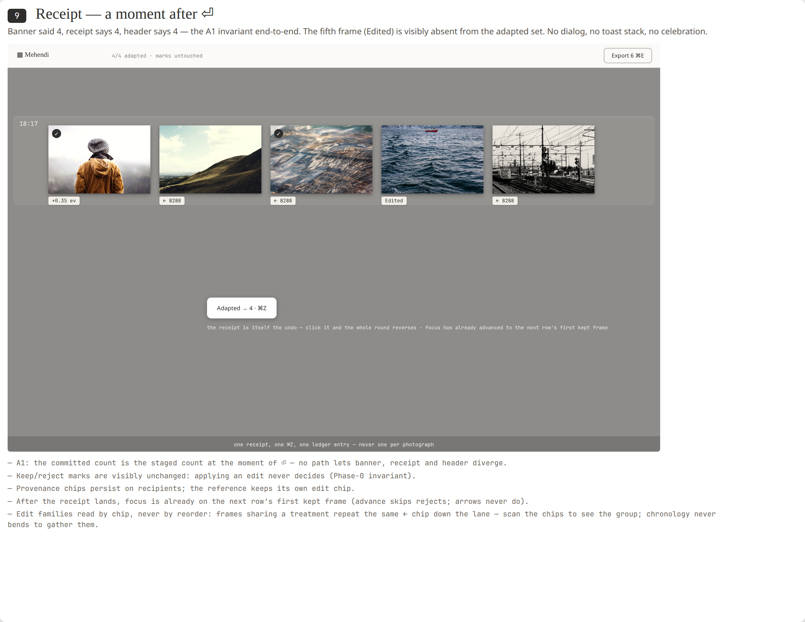

# Lumina

Mac app for culling a shoot. Open a folder or an SD card. Keep with P, cut with X.

Apple Silicon. macOS 14+. Xcode 15+ from the App Store.

These are pictures of the Mac app.

```bash
open design/hifi-v5.html
```



Shoots on the table. Drop a folder to land a new one.



Rows of photos. Keep with P, cut with X.



The frame stays put. You slide the photo under it.



After you apply, a small receipt. Click it to undo.

Click-around mock. Not the Mac app.

```bash
open design/play.html
```

## Setup

1. Clone.

```bash
git clone https://github.com/aniketh-maddipati/vlm_harness.git
cd vlm_harness
```

2. Homebrew, if `brew` is missing.

```bash
/bin/bash -c "$(curl -fsSL https://raw.githubusercontent.com/Homebrew/install/HEAD/install.sh)"
echo 'eval "$(/opt/homebrew/bin/brew shellenv)"' >> ~/.zprofile
eval "$(/opt/homebrew/bin/brew shellenv)"
```

3. Point the CLI at Xcode. Open Xcode.app once if it asks for a license.

```bash
sudo xcode-select -s /Applications/Xcode.app/Contents/Developer
```

4. Install exiftool. The app looks at `/opt/homebrew/bin/exiftool`.

```bash
brew install exiftool
```

5. Build Debug.

```bash
xcodebuild -project Lumina.xcodeproj -scheme Lumina -resolvePackageDependencies
xcodebuild -project Lumina.xcodeproj -scheme Lumina -configuration Debug \
  -destination 'platform=macOS,arch=arm64' \
  -derivedDataPath .derivedData \
  build
```

6. Open the app.

```bash
open .derivedData/Build/Products/Debug/Lumina.app
```

Click **Choose a folder**, or drop a folder onto the window. For an SD card, pick `DCIM` on the volume. Files stay on disk. Keep shoots out of this repo.

7. Playground, optional. Hot reload needs InjectionIII in `/Applications`.

```bash
xcodebuild -project Lumina.xcodeproj -scheme LuminaPlayground -resolvePackageDependencies
xcodebuild -project Lumina.xcodeproj -scheme LuminaPlayground -configuration Debug \
  -destination 'platform=macOS,arch=arm64' \
  -derivedDataPath .derivedData \
  build
open .derivedData/Build/Products/Debug/LuminaPlayground.app
```
