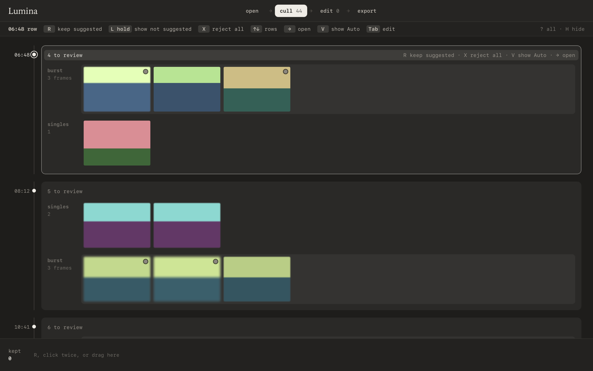
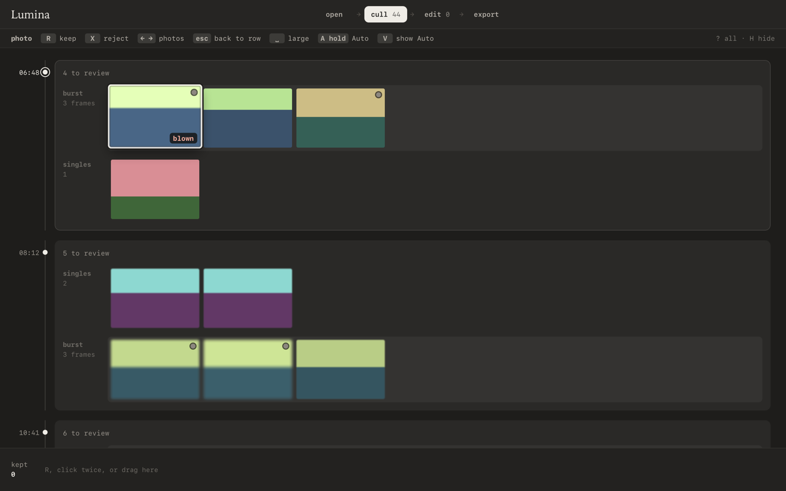
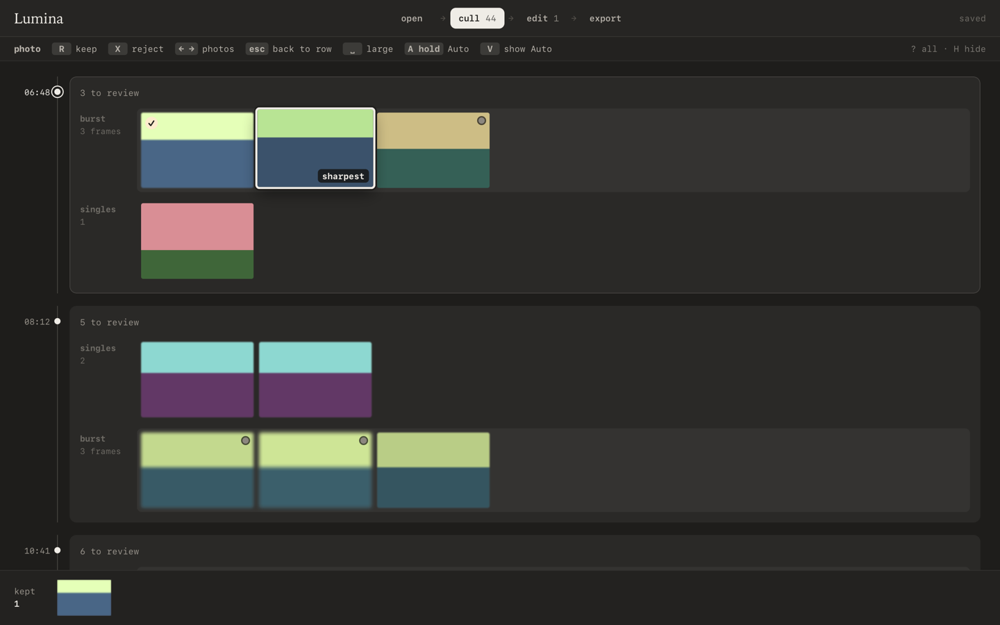
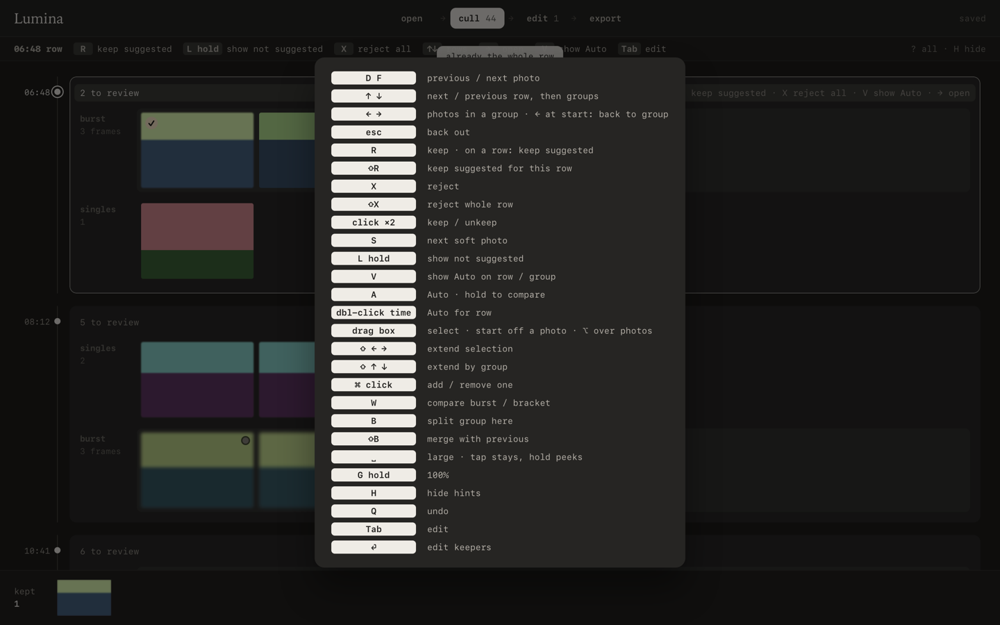

# Lumina

Lumina is a Mac app for culling RAW shoots: Sony ARW, and DNG from phones. Open a card or a
folder, pick the frames you want with the keyboard, and save ratings Lightroom Classic and
Capture One can read. Your files stay where they are.



## How it works

There are four steps, each on a key: Open (⌘1), Pick (⌘2), Edit (⌘3) and Save (⌘4).

**Open.** Press ⌘O and choose a card or a folder, or drop files on the window. Lumina remembers
each shoot, so reopening one picks up where you stopped. Photos you already decided on in another
shoot keep that decision.

**Rows and stacks.** The shoot is split into rows by time: a new row starts after a long gap, or
when the lens, focal length, mode, white balance, flash or ISO changes. Similar frames shot close
together form a stack, which counts as one photo until you open it.

**Pick.** ⏎ keeps a photo and moves on, R marks it not kept, and → passes without deciding. Hold ⇧
to do the same going back. ⇧→ opens a stack, ⇧←→ steps through its frames (the one with the most
detail is marked in gold), and ⇧K or ⇧R decides every frame at once.



**Look closer.** Hold Space for the large view and Z for 100%. In the large view, hold F to show
sharp edges in red and E to show clipped highlights and shadows.

**Nothing is final.** Q or ⌘Z undoes, ⇧Q redoes. When a pass is done, ⇧P starts the next one with
only the photos you kept. Nothing is deleted.



**Edit** (optional). Adjust exposure, white balance, contrast, tone, colour and crop on the photos
you kept. A applies an automatic exposure and white balance. Every change can be undone.

**Save.** ⌘⏎ writes an `.xmp` sidecar with a rating next to each ARW you kept. Phone DNGs you kept
are copied to a Picks folder instead, because Lightroom ignores sidecars for DNG. Export writes
JPEGs with your edits.

Press **?** to list every key.



## What it won't do

- Write to the card or change your original files.
- Move files. Lumina only copies, and it checks every copy.
- Replace a file without first saving a `.lumina-bak` backup.
- Send anything off your Mac. Lumina makes no network requests and keeps its page offline (see
  [Trust and privacy](#trust-and-privacy) for how, and the one caveat).

## Trust and privacy

What Lumina can reach, what it keeps, and what could go wrong, as of 2026-10-06. The full list of
promises, and an inventory of everything the app can reach that CI checks against the code, is
[docs/release/TRUST.md](docs/release/TRUST.md).

### What Lumina can read and write

- Lumina runs in the App Sandbox. It can read and write only the folders you pick in an Open or
  Export panel (or the card you grant access to), plus its own container. It cannot see the rest
  of your Mac.
- It reads the RAW files, their embedded JPEG previews and any `.xmp` sidecars. Edit and export
  read the whole RAW. It never changes, moves or deletes a RAW.
- It writes, only in folders you chose:
  - **`.xmp` sidecars** with your rating, beside the RAWs. Never on a card or any removable volume.
    An existing sidecar is merged (Lightroom's develop settings in it are kept), a `.lumina-bak`
    copy is made first, and if the sidecar changed since the folder was opened, Lumina reports it
    and doesn't write.
  - **Exports**: rendered JPEG, TIFF or PNG files and sidecar copies, in the folder you pick
    (never the card or the shoot folder). A file already there is kept as `.lumina-bak`.
- Edit looks are never written to XMP. Only ratings are.

### What stays on your Mac, and where

Everything Lumina keeps is in `~/Library/Containers/com.aniketh.lumina/`, unencrypted (FileVault
covers it if you use it):

- `shoots/index.json`: recent shoots, with the folder's name and path, the volume's UUID, the
  photo count, the first capture time, the keeper count, the last photo's file name, and a
  bookmark to the folder.
- `shoots/<id>/session.json`: your decisions and Edit looks. `shoots/<id>/Lumina.json`: which RAW
  decoders each camera body supports.
- `exports/`: a journal per export, so an interrupted one can be cleaned up.
- The page's preferences.

Previews and thumbnails are kept in memory, not on disk, and the web view keeps no cache or
cookies. Not checked: caches that WebKit, Core Image or Metal may write on their own (shader
caches hold no image data). File ▸ Remove Working Files deletes a shoot's files from the container.
Sessions from builds before the sandbox stay in `~/Library/Application Support/Lumina` until you
bring them over or delete them.

Similar-photo detection uses Apple's Vision framework on the Mac. There is no face recognition, no
account, no analytics and no crash reporter.

### Network

Lumina's code makes no network requests, and CI fails if a networking API appears in it. The UI is
a web page inside the app, and in a sandboxed app WebKit only starts with the outgoing-network
entitlement (measured 2026-10-01). So macOS does not stop outgoing connections; Lumina does, with
three layers that each hold on their own:

- WebKit's content blocker refuses every load except the app's own `lumina://` files and the
  page's in-memory images.
- Every page file is served with a Content-Security-Policy that allows no network source, frames,
  plugins or form posts.
- WebRTC, which neither layer covers, is removed from the page and from any frame it makes.

The page is bundled with the app, checked byte for byte against the design, and loads no remote
scripts. A test tries 32 ways out (fetch, XHR, WebSocket, images, scripts, styles, fonts,
preconnect, beacons, media, frames, workers, forms, pop-ups, WebRTC, navigation) against a local
listener and fails if any reaches it; it runs in WebKitGTK on every change to the page, and a
shorter check runs in the app's own WebKit on the Mac.

Links leave the app only when you click one of the three it knows (Report a bug, LinkedIn, X).
Report a bug opens a draft email in your mail app with an empty template; nothing is attached and
nothing is sent until you send it.

Whether 1.0 ships this web-based UI or a native one that needs no network entitlement at all is
still open (decision D2 in [docs/release/APP-STORE.md](docs/release/APP-STORE.md)). Only the native
UI would let macOS enforce "nothing leaves the Mac" itself.

### Concerns for professional work

- **Client photos and names.** Photos, metadata and folder names do not leave the Mac through
  Lumina. They sit in the container (paths, folder and file names, capture times) as listed above.
- **Exported files.** A rendered export carries the capture time, camera, lens, exposure, and your
  artist, copyright and IPTC credit from the RAW. It never carries GPS or any other location,
  camera or lens serial numbers, the camera owner field or maker notes. The RAW itself keeps all
  of its metadata, untouched.
- **The system log.** Lumina's log lines mark file names, folder names, paths and error texts as
  private, so `log show` and a sysdiagnose show `<private>` in their place.
- **Cards.** Lumina never writes to a card and treats any removable volume as one.
- **Crash reports.** Lumina has none of its own. If you share analytics with app developers in
  macOS settings, or test through TestFlight, Apple may pass crash logs to the developer.

### What could go wrong

Most likely first:

- **Accidents**: a pulled card, a full disk, a crash mid-write, two apps writing one sidecar.
  Writes are atomic, synced and read back; backups are kept; fault tests cover pulls, full disks
  and kills on disk images.
- **A bad file** on a card someone hands you: a damaged or hostile ARW, JPEG or XMP. Apple's image
  decoders run inside the app, so a decoder bug could run code with the app's access: the folders
  you opened and the container, nothing else. Inputs are size-capped, links inside a shoot folder
  can't lead out of it, and a page that keeps crashing stops reloading after three tries.
- **A compromised page**, through a bad file or a bad design import. It could do what the page
  normally does in the folders you opened (write sidecars, put an export where you choose). It
  can't delete outside the container, write any other kind of file, or send anything.
- **The supply chain.** React and Babel are vendored and pinned by hash, GitHub Actions are pinned
  by commit, the project fetches no packages, and releases are signed from one Mac with keys kept
  outside the repo.
- **Out of scope**: another program running as you, or someone at your unlocked Mac.

### Not yet verified

- A fresh install on macOS 15 and 26, from TestFlight and from the dmg.
- Long runs: 8 hours of use, 10,000-photo shoots, repeated kills.

## Run it

You need Xcode 16.4 or later, an Apple silicon Mac, and macOS 15 or later.

```bash
open Lumina.xcodeproj
```

Choose the **Lumina** scheme and **My Mac**, then press ⌘R.

## For contributors

The UI is designed in Claude Design and ships unchanged inside the native window, so don't edit it
in this repo. [AGENTS.md](AGENTS.md) explains how the pieces fit together and how to sync a new
design.
