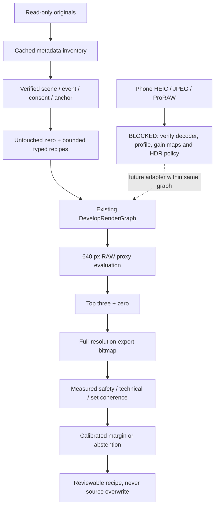

# Sony/iPhone harmonization foundation

Checkpoint: 2026-09-23. Research and opt-in measurement infrastructure. Product Auto,
hand recipes, shared renderer, UI, source files and other worktrees are unchanged.
No training or model inference was performed. This is not cross-device validation.

## Audit and ownership

Fetched `origin/main` and verified clean detached base
`a3b7fe751dca3bdffac91015c60a8ecf7c7e9ed2` (PR #104). Created unused
`codex/harmonization-foundation`. Inspected all local/remote branches sorted by
commit date, recent history, and all worktrees before editing. Local `main` was stale;
it was not used. Parent owns `codex/product-performance-baseline` at `2da4659`.
The UI task owns `codex/ui-check-finish`; its newly reported canvas rotation issue
is a separate prerequisite, not fixed or claimed passed here.

Relevant history: `110e9c6` adds model Develop/eval; `485df48` integrates current UI;
`c3f2a89` fixes current-UI RAW intent parity, merged by the base. Research branch
`codex/sony-assist-next` at `6ae17c2` has `TechnicalAssist`, `sony_inventory.py`,
`technical_cache.py`, `technical_review.py`, and fixture evaluation. Its conservative
actions, private SQLite inventory and embedded-preview contact method inform this
checkpoint; its older UI and engine changes were not copied onto main.

Current code authority:

- `EditRecipe` persists edits; `RawIntent`, `LookIntent`, `GeometryIntent` derive values.
- `PreparedRawSession` and `DevelopRenderGraph` perform production decoding/rendering.
- `DevelopColorPolicy` uses extended-linear sRGB and RGBAh intermediate evaluation;
  TIFF exports use ProPhoto/ROMM, JPEG exports sRGB. Its introductory TIFF comment
  still says Adobe RGB; the executable policy is ProPhoto. `DevelopIntents` also has
  stale comments about pinned interactive exposure/WB; current graph bakes both tiers.
- `AutoDevelop` still sets native Kelvin without native tint, adds default tone and
  vibrance, and may straighten. It is measured separately, not presumed safe truth.
- `ModelAutoDevelop` bounds eight fields and falls back to Auto, but has no calibrated
  confidence or verified cross-camera scene context. Existing reports show poor VLM
  performance, including failure to notice an upside-down control.
- `DevelopEvalHarnessTests` and `run_raw_parity.py` supply existing parity infrastructure.
  `docs/RAW_PREVIEW_EXPORT_PARITY.md` records historical 45/45 mean CIE76 <=1.5 cases.
  Those are prior evidence, not fresh phone measurements in this checkpoint.
- HEIC/JPEG currently enter the render graph as compatibility/proxy fallback. No
  gain-map/HDR-preserving authoritative rendered-image adapter was found. ProRAW
  support is unverified. These paths cannot be promoted by changing a fidelity label.

## Actual and proposed paths



Solid measurement path exists for Sony ARW. Scene/anchor approval, full technical
safety, set-relative scoring and calibrated acceptance remain prerequisites.
`HarmonizationMeasurementBridge` accepts only typed parameters, calls the production
graph internally, and returns measurements/recipe provenance, never replacement pixels.
There is no renderer callback or image-generation operation. The XCTest bridge checks
Sony ILCE-7M3 metadata before execution. Product mutation/persistence is not invoked.

## Research decisions, with primary sources

These sources motivate experiments; none validates this implementation or its thresholds.

1. [Predicting Range of Acceptable Photographic Tonal Adjustments, ICCP 2015](https://projects.csail.mit.edu/acceptable-adj/acceptable_adj.pdf)
   studies acceptability regions in brightness/contrast space with multiple human
   judgments. We adopt bounded alternatives and keep preference separate from technical
   acceptability. Confidence intervals and abstention are our safety requirements;
   the paper does not establish calibrated bounds for all Lumina controls or cameras.
2. [Deep Bilateral Learning for Real-Time Image Enhancement, SIGGRAPH 2017](https://arxiv.org/pdf/1707.02880)
   predicts bilateral-grid affine transforms from low-resolution features and uses a
   learned full-resolution guidance/slicing path. Our initial global recipe search is
   simpler. Color management and preview/export parity are Lumina requirements, not
   demonstrated cross-camera properties of HDRNet. A coarse local grid needs measured
   global-control failure and separate artifact testing before implementation.
3. [Harmonizer, ECCV 2022](https://arxiv.org/html/2207.01322v1)
   predicts understandable filter arguments and evaluates foreground/background
   composites on iHarmony4. Its video adaptation uses parameter EMA. This supports
   examining parameter controllers; composite harmonization is not Sony/iPhone set
   validation. Current trusted controls exclude whites/blacks/texture/clarity/dehaze;
   positive highlights are also excluded because the existing filter cannot express them.
4. [Deep White-Balance Editing, CVPR 2020](https://arxiv.org/pdf/2004.01354)
   explains why post-ISP sRGB WB correction differs from sensor-domain WB. It infers
   low-resolution outputs then fits a global polynomial mapping for full-size pixels.
   We do not copy that network or claim inverse-iPhone-ISP recovery. RAW and rendered
   inputs require separate, verified adapters; the paper does not establish Apple HDR
   gain-map preservation or ProRAW decoder correctness.
5. [Learning Blind Video Temporal Consistency, ECCV 2018](https://www.ecva.net/papers/eccv_2018/papers_ECCV/papers/Wei-Sheng_Lai_Real-Time_Blind_Video_ECCV_2018_paper.pdf)
   uses a recurrent network with short/long-term temporal and perceptual losses for
   independently processed frames. Our proposed shot-level parameter smoothing is an
   experiment, not that paper's implementation. Video needs temporal measurements;
   independent per-frame photo decisions are not a finished video solution.
6. [PhotoAgent: Exploratory Visual Aesthetic Planning with Large Vision Models, v3](https://arxiv.org/html/2602.22809v3)
   is the editing/MCTS paper, distinct from the robotic-photographer title. Appendix A
   discusses reduced/full-resolution ranking agreement and top-K rescoring. We adopt
   those evaluation questions without its generative edits, MCTS or aesthetic reward.
   Its reported retention numbers must not be transferred to Lumina. MCTS remains
   gated on held-out benefit beyond fixed policy, lattice and coarse-to-fine search.

## Inventory checkpoint

`Scripts/harness/harmonization/inventory.py` uses exiftool read-only, persistent SQLite
metadata batches, versioned extraction keys and atomic manifests. Source identity is
path SHA-256; the inexpensive freshness fingerprint is size/mtime-ns/ctime-ns/inode/device,
not a content hash. Renaming changes the asset ID. Existing RAW content identities are
reused only with matching size/mtime; their original SHA/probe evidence is retained.
This is not adversarial content-integrity verification. Benchmark execution additionally
checks full SHA-256 and source stat before/after its small selected fixture.

Metadata includes grouped EXIF/container evidence, camera/lens/exposure, original time
and offset evidence, orientation/dimensions/previews, profiles/HDR/gain-map tags,
video duration/rate/color tags, burst identifiers, errors and missing fields. GPS
coordinates and serials are discarded; GPS presence is retained. Missing HDR tags do
not imply SDR. iPhone DNG means candidate, never verified ProRAW. Pixel decode remains
UNMEASURED in the metadata scan. Near-duplicate visual membership remains unmeasured.

Symlinks, AppleDouble/system indexes and declared generated-evidence roots are skipped.
Lightroom previews/Adobe Imagecore and known Photos derivative paths are classified as
derivatives. Dataless placeholders are not opened. The tool does not query cloud-only
library records, so it cannot count missing cloud originals. It does not infer unedited
status from absence of XMP or open a Lightroom catalog to claim edit history.

Private evidence: `/private/tmp/lumina-harmonization-evidence/inventory/`.
The T7 + local Lightroom scan found 15,109 files. Expanding to accessible
`/Users/aniketh/Pictures` added 94 Sony ARW files, producing 15,203 file records:

| Classification | Files |
|---|---:|
| RAW/DNG candidates | 5,270 |
| Rendered files excluding known library derivatives | 1,599 |
| Known cache derivatives | 8,022 |
| Video files | 309 |
| Unrecognized/error files | 3 |

In that initial scan, 7,196 records identify Sony ILCE-7M3; 8,007 lack camera identity. No accessible file
identified iPhone, HEIC/HEIF, or verified ProRAW. This does not prove the unknown files
were never from a phone. Photos and Photo Booth libraries are inaccessible due to
macOS permissions; `scan_complete=false` and `discovery_errors` record both paths.
The inventory is complete only for accessible, recognized candidate paths in scope.
The 496 wall-clock groups are unverified; zero Sony/iPhone scene groups are established.
Ten-minute buckets can miss pairs across boundaries or clock offsets and join unrelated
events. They are navigation suggestions, never scene truth or split authority.

### Subsequently supplied iPhone folder

The owner supplied `/Volumes/T7/iphone` after the initial scan. The volume treats
`iPhone` and `iphone` as the same directory. Counts grew during transfer; repeated
cached scans finally covered 217 JPEGs, with an additional PNG inspected separately:

- 216 JPEGs identify iPhone 16 Pro Max and carry Display P3 profiles.
- One WYZE-named JPEG has no camera identity/profile; do not count it as verified iPhone.
- `IMG_3839.PNG` is 1320×2868 with no reported camera identity; it is outside the
  JPEG/HEIC/RAW inventory extension filter and was inspected using basic metadata only.
- 213 identified phone JPEGs were captured on 2026-08-07; three on 2026-08-08.
  Explicit capture offsets include -07:00 and -04:00. Do not assume one timezone.
- All 217 JPEG metadata records extracted without errors. Full pixel decode remains
  UNMEASURED. No HEIC or ProRAW file was supplied in this snapshot.
- Sample JPEGs retain Apple HDRHeadroom/HDRGain and AROT HDRGainCurve tags. These do
  not establish auxiliary gain-map preservation or correct HDR rendering by Lumina.
- Metadata and filenames do not establish untouched-original or edit-history status.
  Some dimensions are consistent with crops/panoramas; provenance still needs review.

Private incremental manifest/report/cache: `/private/tmp/lumina-harmonization-evidence/iphone-inventory/`.
AppleDouble files were excluded, GPS coordinates discarded, and sources stayed read-only.
No Sony record in the existing inventory shares either capture date. That prevents a
timestamp-based paired shortlist, but is not proof that the scenes differ if clocks or
dates are wrong. Visual verification is still required. The 216 phone JPEGs are ample
for a rendered-JPEG adapter pilot; HEIC/ProRAW coverage and verified Sony pairs remain
missing. The earlier broad inventory and empty benchmark draft are historical snapshots,
not an assertion that no phone files now exist.

```sh
python3.12 Scripts/harness/harmonization/inventory.py \
  --root /Volumes/T7 --root /Users/aniketh/Pictures \
  --exclude /Volumes/T7/Lumina-performance-2026-09-23 \
  --exclude /Users/aniketh/Pictures/lumina-harness \
  --exclude /Users/aniketh/Pictures/lumina-fixtures \
  --reuse-raw /Volumes/T7/Lumina-performance-2026-09-23/raw-inventory/raw-discovery-classified.jsonl \
  --extensionless --out /private/tmp/lumina-harmonization-evidence/inventory
```

## Benchmark and review design

`benchmark.schema.json` is the interchange schema; `benchmark.py` drafts candidate
scenes and checks event/content-identity/burst split leakage. A draft can contain zero
scenes; it must not fabricate phone pairs. Initial `benchmark-draft.json` is empty.
Targets remain 30–50 scenes / 100–200 combined assets, without statistical significance
claims. Keep complete sets, easy/hard pairs, daylight/shade/mixed/night/HDR strata.
Obtain consent for local people/skin review and do not infer identity or race.

Start with 6–8 unmodified phone originals for decoder/profile/orientation/HDR smoke tests.
Then 20–30 phone originals in 5–10 Sony-matched scenes are sufficient for the first pilot.
ProRAW is optional when actually available. Export unmodified originals without format
conversion; no cloud transfer is required. Freeze shoot/event splits only after human
verification. Near-duplicates, bursts, exact copies and an event must never cross splits.

Blind review artifact design: one complete scene per page at delivery size (long edge
2560 px plus 1:1 crops). Randomize opaque arm labels within each scene with a recorded
seed; put the key in a separate private file. Preserve image order/composition between
arms. Include untouched, current Auto, deterministic search and only available learned
arms; optional taste gets a separate label in the hidden key. Ask independently:
visible set outliers; artifacts and locations; technical acceptability vs original;
set coherence; personal preference. Allow no difference/uncertain/abstain. Reviewer
must assess the whole set before marking frame outliers. No learned arm is currently
run and no blind aesthetic result is claimed.

Failure gallery: `contact_sheet.py` creates local metadata/access failure cards and
camera embedded-preview inventory examples, using the existing Sony inventory method.
Neither is an app capture or harmonization output. Missing/invalid images get an
explicit failure card, not fabricated replacement pixels. Future rendered failure
cards must include original/candidate/anchor, masked matching regions, exact recipe,
fidelity, profile/HDR flags, clipping/color/local artifacts, gate reasons and versions.

## Deterministic measurement and precise next implementation

`run_benchmark.py` exercises `HarmonizationRenderHarnessTests` against a built XCTest
bundle. Candidate zero is fresh untouched/as-shot, independent from hand recipes.
The lattice adds -1/3 EV, +1/3 EV, highlights -20, shadows +15. These are experimental
engineering bounds, not learned acceptable ranges. Typed WB/tint, contrast and color
controls exist but the first lattice does not invent their values without an anchor.
Current Auto uses the actual `AutoDevelop.recipe` and actual session statistics.

Every candidate uses `DevelopRenderGraph`; failures cannot win ranking. The initial
diagnostic ranks sampled highlight+shadow clip fraction, preserving zero on a tie.
It can prefer a damaging darkening and is not an acceptance metric. The best three
plus zero are rendered at full resolution, with `--audit-all` available to re-render
the whole lattice and obtain unbiased ranking comparisons. Receipts distinguish
full-resolution export bitmaps from their **640-edge, Display-P3 8-bit sampled luma**
measurements. These are not full-pixel clipping, perceptual Lab, encoded-file parity,
visible UI presentation, or cross-composition harmonization metrics.

Selection currently always abstains. No recipe is applied or persisted. The runner
records recipes, deltas from untouched, render IDs, per-tier measurements/failures,
engine/policy versions and non-application reasons. One bounded pass stops because no
validated remaining-gain model exists. Acceptance margin and expected gain are null;
invented calibration cannot enable acceptance. Learned scorer/range/VLM and
coarse-to-fine arms are explicitly NOT_RUN, not silently replaced with neutral.

Before enabling decisions:

1. Add a verified rendered-original source adapter inside the existing graph, preserving
   ICC/transfer/gain-map evidence. Explicit SDR conversion is a separate declared output
   policy. Verify Apple ImageIO/Core Image auxiliary data and CIRAW ProRAW behavior with
   real samples; unsupported cases abstain without silently stripping HDR metadata.
2. Extend existing parity tests with phone orientation/crop/rotation, source/output
   profile, repeat export determinism, declared HDR/SDR conversion, absent fallback,
   original hashes, and existing <=1.5 mean CIE76 comparisons where SDR comparison is valid.
3. Add full-pixel clipping/gamut tests and matched-region linear exposure/Lab/chroma
   features. Only verified common content may contribute cross-device color distance.
   Check neutral/skin regions with explicit labels, halos/local discontinuities and
   sharpening/noise separately. Whole-image metrics between unrelated compositions are
   prohibited. Derive per-scene anchor trust; missing/mixed/subject-mismatch evidence abstains.
4. Calibrate safety limits and meaningful improvement margin on development/validation
   events, freeze before held-out evaluation. Hard engine/fidelity gates precede
   technical metrics, then set coherence, then optional taste. Aesthetic scores cannot
   rescue failures or be sole reward. Measure coverage-risk at several confidence thresholds.
5. Only then add a two-round coarse-to-fine loop: top-three rescoring plus same-fidelity
   zero each round; stop after two non-improving rounds or expected gain below the
   frozen margin, with a fixed candidate/time cap. Those stopping counts are proposed
   engineering defaults awaiting cost/quality measurements, not empirical proof.
6. Compare fixed Auto, lattice, coarse-to-fine, simple feature scorer, low-res image
   scorer and range predictor. Train only after valid data and deterministic baselines.
   Persist source/anchor/recipe/confidence/intervals/algorithm/engine provenance and
   stage via existing edit binding/journaling with edit/revert; never overwrite hand work.

Video interface reservation: shot ID, boundary evidence, base recipe, timebase/FPS,
manual keyframes/overrides, stable-light WB lock, bounded parameter velocities,
smoothing version and flicker measurements. Reuse the photo transform; no video editor
or temporal network exists here. Measure temporal residuals separately from legitimate
motion/lighting changes. A learned network needs evidence simpler smoothing fails.

## Performance and verification

Metadata initial T7/Lightroom run: 305.41 s internal scan, 307.26 s process wall,
15,109 records, 49.47 records/s, zero application-cache hits; OS cache uncontrolled.
Initial RSS/footprint unavailable because sandbox blocked `time` resource access.
Expanded accessible Pictures run: 11.24 s internal /13.16 s process wall, 15,109 cache
hits plus 94 new records, peak RSS 377,397,248 B, footprint 370,440,760 B. This is a warm,
expanded scan with changed scope; do not report it as a cold/warm speedup ratio.
Python reports x86_64 under its installed runtime on the Apple Silicon host.

Full isolated Debug build passed. Logic suite: 512 tests, 5 fixture skips, zero failures.
FAST: 41/41 orchestration checks. Python inventory/controller tests: 12 passing at this
checkpoint, expanded to 14 after derivative/access-gap tests. Vet was invoked after code units and blocked by missing ANTHROPIC credentials;
it did not pass. No push/PR/merge; no PR-only double cache-free checkpoint was claimed.

Sony smoke measurements and remaining limitations are recorded in the private runner's
`report.json`, per-stage receipts and Xcode logs. A separately launched `/usr/bin/time`
around xcodebuild includes the test process tree, not isolated renderer peak memory.
Decode/features/inference/candidate render/rank and output encode need separate timings
before budgets. Presentation latency, navigation cache cancellation, physical footprint
by stage, phone export and human set review remain UNMEASURED in this workstream.

The one-image Sony smoke (`sony-smoke`) measured all five lattice candidates plus
current Auto at both tiers. All five lattice full bitmaps are 6000×4000, no fallback
or measurement failures, original SHA/stat unchanged. Lattice-only diagnostic ranking
retains the top choice and includes the full winner in proxy top three; Spearman 0.90,
one image / five paired candidates. `lattice-agreement.json` separates these from the
initial `report.json` agreement that included Auto (six candidates, correlation 0.943).
Proxy per-candidate durations: 34.74–526.72 ms; full bitmap+sampled stats:
553.33–915.46 ms, 3.58 s total for the lattice. Ordering warms caches; no latency
population or quality conclusion follows. Selection abstained as required.
`postrun-source-manifest.json` records the uncommitted Swift source files used, captured
after the run; the runner now records source hashes before future runs as well.
The original working-diff hash alone did not capture newly untracked files, so it is
not sufficient build provenance on its own.

Proven here: resumable accessible-file inventory, typed bounded candidate interface,
existing-engine measurement wiring and explicit abstention. Promising but unproven:
matched-scene candidate search with calibrated limits. Remaining prerequisites: phone
library access for unavailable formats, verified HEIC/ProRAW coverage and paired-scene corpus.
Supplied JPEGs resolve the lack of accessible phone input. Prior VLM aesthetic/perceptual judgments
remain unreliable. Correct engine behavior, deterministic adjustment, cross-device
normalization, set coherence, optional style preference and temporal video consistency
are separate achievements. Training is not justified yet. The next smallest experiment
is the 6–8-file phone adapter audit, followed by verified paired-scene deterministic review.

## Integration status

Foundation checkpoint `4b8035d` is locally committed and tested. This does not complete
the harmonization product. The separately authorized documentation-only UI report
commit `59dbaf4` is first in the current integration queue, pending its required gates.
The owner subsequently authorized publication/merge of this independently scoped
foundation after the UI report. Integration still requires review against fetched main,
its own two-round cache-free checkpoint and applicable CI on the final head. Exact
integration results and the merge commit are recorded in the PR rather than inferred
from the earlier checkpoint tests.

Parent-owned instrumentation `2da4659` is independent groundwork. Its whole-product
baseline and presentation correlation remain incomplete; it is neither a dependency
nor a merge-ready prerequisite for this foundation. Keep it local until the parent
finishes its evidence and scope. The UI rotation defect also remains a separately owned
correctness follow-up; these measurement foundations do not fix or certify it.
