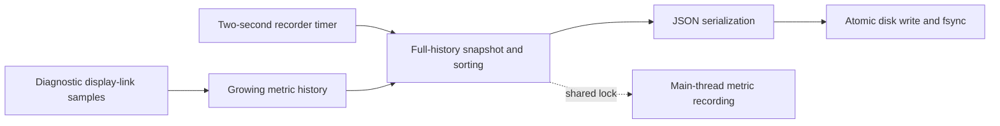
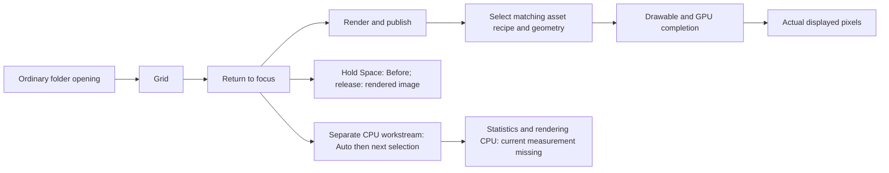

# Lumina global report

## Active UI feedback and chronology increment

CHRON-01 owner reports implementation present in d41d: fixed left metadata column removed, full-width vertical date/time headings, horizontal real-chapter boundary labels suppressed for manual set order, width-aware open-burst wrapping. Compile underway; frozen chronology-only diff/review requested before later units. Evidence `/private/tmp/lumina-chron-01`; existing checked scroll callbacks reportedly untouched. No native chronology verification claimed; vet credentials remain blocked.

User supplied screenshot of version column: Shot populated, Auto/Yours gray; source explicitly returns no preview for versions2/3 and silently no-ops Yours without handRecipe. VERSION-01 read-only audit assigned export owner for genuine scheduler-backed focused-only previews and honest lifecycle, no canonical preapply/bulk preload. User layout choice pending: recommended compact version controls with optional comparison versus smaller genuine-thumbnail rail with unauthored Yours collapsed. Do not assume screenshot binary identity or full-window layout; do not implement undecided redesign. Objective feedback/stale-state corrections remain within assigned Auto owner scope after audit.

Audits completed, implementation assigned to same interaction owner in bounded sequential patches to avoid session collisions. Auto: current untracked async measurement lacks true disabled/reentrancy/shoot-source fences; preserve existing set-else-all/as-shot algorithm and one undo, introduce real task lifecycle plus guarded measurement writeback, static reduced-motion equivalent and truthful adjustment-only result (render/persistence complete separately). IO-UX source findings: (1) preparation/offline/errors may be invisible after leaving Open; (2) photo/multi-root drops silently expand to first parent/ignore other roots; (3) interrupted export hides count receipt; (4) known completed job still offers retry; (5) summary omits JPEG quality/destination subfolder and can obscure frozen resume settings. Export3–5 authorized for implementation here, renderer/store unchanged. Import1–2 reserved for ownership reconciliation with Cursor, no edits assigned. Native feel, accessibility and permission scenarios remain unverified until actual native checks.

User reconfirms execution, including concrete import/export improvements from audit. Cursor work is concurrent but paths/file ownership are not yet supplied. Proposed split is import/open work in Cursor and chronology/Auto/export here; it is not confirmed. Keep import/open writes unassigned to prevent collisions; independent audit continues. CHRON-01 owner confirmed d41d and reserved ElasticTableView/Filmstrip/WrapLayout, narrow chronology helper/tests as needed, scoped contract/copy updates; Auto later reserves ElasticRootView and minimal session lifecycle after audit. Existing tokens reused. Capture pre-change hashes and separate new patch against exact99a+export00f269a+scroll5ff; no native retry or claim that these new improvements have passed checks yet.

IO-UX-01 added by explicit user request: independent reviewer audits current import/open and export surfaces read-only alongside chronology implementation and Auto lifecycle inspection. Scope is actual existing screens/inline controls, clarity, defaults, status/error/partial outcomes, accessibility and recovery, with top five evidence-linked improvements. No new page, renderer or persistence system assumed. Native screenshots unavailable under current capture block, so visual feel remains unverified. Reusing available reviewer avoids extra context/task overhead; new tasks remain authorized when an independent deliverable justifies them. Chronology frozen-diff review takes priority on arrival; reviewer does not implement its own findings.

User explicitly requests Auto loading feedback and removal of the left time column, showing chronology along the scrolling axis. CHRON-01 assigned to existing interaction owner on d41d, preserving frozen export+scroll checkpoints and isolating new diff. Intended implementation: compact in-flow time section labels on vertical table; chronological boundary markers on horizontal strip only where actual chronological ordering applies; full photo width without fixed metadata column. Preserve grouping/IDs/timestamps/selection/manual set order and existing scroll correction. No automatic resegmentation was chosen. Open-burst unbroken horizontal layout is a source-supported crowding lead, not reproduced native evidence.

Interaction owner exclusively owns edits and heavy checks; export owner performs independent read-only Auto lifecycle audit; reviewer waits for frozen diffs. Auto work follows chronology under same owner: real task-bound button feedback, reduced-motion/accessibility equivalent, duplicate-action prevention and truthful terminal state; no fabricated percentage, no Auto algorithm/model changes or false displayed/saved claim. User visual direction permits narrow contract amendment. Native capture remains blocked pending changed state; no repeated capture loop. No implementation success claimed at dispatch.

## Current checked checkpoint — INTERACTION-02

**PARTIALLY VERIFIED / native acceptance BLOCKED.** Final scroll patch `5ff1e143a03cf8dbdf11f7e02496d991b43185f36450914c9679fd45fd6080f6`, on base99a plus isolated export00f269a in d41d, has independent source clearance. Root inspected `identity-final.json`, `final-logic.log` and `fast-final.log` under `/private/tmp/lumina-interaction-02`: final compile PASS; full logic543 total/six skipped/zero failures (537 passed), including ten request/rectangle tests; FAST41 orchestration/zero app tests PASS. Exact four-file scroll diff and all23 export source-manifest entries were verified unchanged by owner. Prior revisions and failures remain separately attributed. Vet credentials BLOCKED; cache-free checkpoint not run; no merge/release readiness implied.

Intended behavior: visible focus does not command a scroll; offscreen focus requests minimal reveal; filmstrip handles initial/resized focus; table return resolves current burst cover with chapter realization; manual native scrolling cancels pending reveal. No selection/pinch/session/tile-sizing/physics changes. Native baseline binding failed ScreenCaptureKit -3811 before scroll input; candidate was never manually launched. No actual pixels, momentum, descendant-ID/layout/observer delivery, input-to-visible improvement or approximately1,000-photo resource acceptance exists. Exact baseline/candidate binaries+dylib hashes are in the identity manifest; historical PID is not a fresh observation.

Owner explicitly released heavy/native/UI lease. Next action is supported native verification of this exact export baseline versus scroll candidate, after access/capture state changes; do not repeat the failed capture unchanged. Founder selection-scope and dragged-group ordering choices remain pending for subsequent increments. No extra workers required at this checkpoint.

## Current interaction increment and concurrency policy

Third frozen scroll candidate `/private/tmp/lumina-interaction-02/scroll-final.patch` SHA256 `5ff1e143a03cf8dbdf11f7e02496d991b43185f36450914c9679fd45fd6080f6` independently rehashed. Owner reports chapter/tile combined preference readiness, immediate filmstrip resolution with size guard, and native live-scroll cancellation without consuming events or replacing physics. Final compile PASS; final full logic underway and independent reviewer already sent exact patch. Same four owned files, export/session unchanged. Prior6648 compile/eight tests/FAST passes are separate prior-revision evidence. Two corrective revisions have produced concrete changes; further architectural uncertainty requires reassessment rather than blind repetition. No further -3811 capture attempts.

Scroll revision6648 rereview remains REVISE: previous structural findings addressed, but focus/content reveal must resolve immediately against existing valid frames as well as later preferences; otherwise callback ordering/no geometry delta can leave a request armed until manual scrolling. Table readiness must correlate with the requested chapter/layout generation, not any next tile preference callback (including empty/old/intermediate data). Owner assigned bounded corrections, supersession/route cancellation and both-ordering tests. These are source-supported event-order risks, not native reproduced defects.

Scroll lifecycle revision frozen: `/private/tmp/lumina-interaction-02/scroll-revision.patch` SHA256 `6648b7fc3eef680cc80d1c992876b05d43ae058ad3d6cb6e12a14f93b79b2cef`, rehashed by root; owner sent directly for independent review, revised compile in progress. Initial scroll5bae full logic passed537 total/six skipped/zero failures (531 passed), real exit0; this does not validate the subsequent lifecycle revision or clear the separately preserved export-only full-suite failure. Owner verified all23 frozen export source hashes still match. Four-file scroll diff excludes imported export coverage evidence; source remains view-owned without session mutation.

Scroll revision1 (`5bae0fa…`) compile passed; owner reports four geometry tests/zero failures, FAST running at handoff. Independent source review disposition REVISE: initial or layout-only filmstrip changes do not reveal unchanged focused ID; focus-triggered tile resize uses stale geometry with no subsequent reconciliation; table return anchor may refer to a collapsed burst's no-longer-rendered child and is captured too late during teardown. Lazy offscreen nested tile resolution also requires bounded container-first realization or native proof. Owner instructed to correct lifecycle behavior without following arbitrary manual scrolling or recentering visible focus, and add lifecycle-focused checks. Pure rectangle tests are insufficient; no native behavior accepted.

INTERACTION-02 source candidate frozen for review: `/private/tmp/lumina-interaction-02/scroll.patch`, SHA256 `5bae0fa35df2d6a25ad833c45259106c9c20c8dc1e06325af9a7ddc2919bb201`, independently rehashed by root. Four owned files: ElasticTableView, ElasticFilmstrip, new ElasticViewportReveal and tests. d41d now includes exact frozen export patch00f269a as a separately identified base on99a, allowing consistent candidate identity without recorder/selector integration. No new session/input-origin state. Native baseline exact-app binding failed ScreenCaptureKit -3811 before any scroll action; no visual or momentum baseline captured. Owner holds compile/test lease, vet credentials blocked; independent reviewer assigned frozen scroll diff, especially lazy target resolution and return-anchor lifecycle. No native improvement claimed.

Updated-UI native checkpoint: native owner launched exact export candidate `/private/tmp/lumina-ordered-jpeg-evidence/DD/Build/Products/Debug/Lumina.app`, verified live executable/debug dylib and instrumentation-off flags, and opened approved disposable `card-clean-500` through the ordinary path. AX reports JPEG/sRGB, full-size and quality95 settings. Screenshot capture failed ScreenCaptureKit -3811: **no displayed-pixel verification**. This is a new export-candidate cohort check, not historical selector acceptance. Exact provenance/limitations in `updated-ui-rca.md`; same-name different bundles explain potential UI confusion, while tracked-only cache hashing/HEAD-only snapshots remain additional source-supported hazards. Neither establishes test-exit causality. Native owner released lease; INTERACTION-02 owner now has heavy/native/UI lease for exact-build scroll baseline/candidate checks, with fresh process validation and no unsupported gesture substitution.

Interaction isolation confirmed: `/Users/aniketh/.codex/worktrees/d41d/vlm_harness`, branch `codex/interaction-scroll-reveal`, exact base `99a5785be3d400e2fbc9ee791a7aa880ed2f4434`. Owner is preparing view-owned viewport/reveal policy and geometry coverage; no session edits or heavy checks reported. Native momentum/current tile sizing remain intended invariants. Shared input-origin changes require an exact dependency request, not parallel focus state. Heavy execution waits for current native owner release.

Bounded diagnostic completed: unchanged baseline99a then frozen export candidate each passed the exact RAW target (one test, zero skips/failures), same six ARW hashes and identical test source. Code0 host exit from the earlier full suite was not reproduced in isolation; cause remains unattributed and the original full-suite result remains FAILED. Evidence: `baseline-raw-target.log`, `candidate-raw-target.log`, JSON/xcresults and updated `HANDOFF.md` under export evidence directory. Export owner explicitly released source/heavy lease with no drift. Heavy/native/UI lease now assigned to existing reviewer task for separately user-requested updated-instance provenance/rerun, distinguishing native-operator work from independent source review. Interaction owner continues disjoint source work, no heavy checks until release. No recorder/selector merge or unrelated process termination authorized.

Frozen export checkpoint: base `99a5785`; `/private/tmp/lumina-ordered-jpeg-evidence/candidate.patch` SHA256 `00f269a211c407a1e637c2e369042824e2cfb70f7ac63f43dec5d25fd67d3d07`; `candidate-source-hashes.json` SHA256 `529efc475b7f1ab6636dc197e3eb3b072febaf6e379531a06e47244d7479eef3`. Root independently rehashed both. Owner keeps source frozen during the bounded baseline→candidate exact-test comparison, with six real ARWs inventoried in `diagnostic-fixtures.json`. Clean baseline build uses separate checkout/derived data. Reviewer has a separately reported user request to investigate old versus updated UI instances; current assignment is read-only provenance until heavy lease release, with no app relaunch or termination. UI provenance and the test-runner exit remain separate hypotheses.

INTERACTION-01 audit completed source-only on `99a5785`. Active Elastic table/filmstrip use native SwiftUI scroll views; focus changes unconditionally center chapter/photo, and return anchor is not consumed. No active pinch mapping found (legacy handlers are not active-root proof). Table modifiers use authoritative selection but range spans underlying assets; filmstrip omits modifiers; Shift-arrow and explicit photo Select All are missing. Shelf ignores drop position and can report success without mutation; no reorder/order-undo/edge autoscroll exists. No performance or native observation is inferred. Founder questions pending for visible-representative versus hidden-member selection and displayed versus selection-click group order; pinch decisions deferred until needed.

INTERACTION-02 assigned to existing selector owner: isolated99a5785-based source implementation of nearest-edge/visibility-aware reveal and meaningful return anchor, preserving native momentum/tile sizing. Ownership limited to ElasticTableView/ElasticFilmstrip/new helper/focused tests; shared session mutation requires explicit coordination after export source freeze. No competing builds/tests/native runs: export owner retains heavy lease for bounded failed-gate comparison. This is the second implementation owner with disjoint file scope; reviewer remains independent. Native acceptance blocked, not waived. No pinch redesign, custom physics or speculative lazy-layout replacement authorized.

Current export verification: `compile-5.log` OK; `fast-3.log` PASS41 orchestration/zero app tests; expanded ordered-export tests PASS13/0. Full `logic-1.log` FAILED: xcresult summary533 total,526 passed,6 skipped,1 failed at `PhotoRenderProofTests/testRawFramesRenderUprightThroughTheGraph`; runner exited code0 before finishing, then restarted. Later88/0 is only the resumed segment. Preserve `/private/tmp/lumina-ordered-jpeg-evidence/logic-1-summary.json` and original xcresult. Independent review has no remaining blocking source finding, but failed full gate prevents acceptance. No baseline attribution exists. Export owner retains a bounded heavy lease extension to inspect prerequisites, freeze candidate identity, and if valid compare exactly that test on unchanged99a5785 then candidate once each with separate derived data; no broad RCA or skip/threshold changes. Release after result or exact prerequisite blocker. Interaction audit stays read-only meanwhile.

User authorizes bounded scroll/trackpad/selection/group-drag/set-order work, preserving founder ownership of undecided UX. Full request: `/Users/aniketh/.codex/attachments/2003dd7c-df0d-45a4-be0b-1a26bb4955d4/Pasted text.txt`. Concurrency/context addendum: `/Users/aniketh/.codex/attachments/6bed8179-fcb6-4f8d-8335-5b26a10a0433/Pasted text.txt`. Reuse idle owners; at most two independent implementation workers initially, reviewer on concrete frozen diffs. Heavy execution stays serialized, and native/UI/catalog ownership is explicit. Worktrees do not isolate machine resources. Compact task contracts/checkpoints preserve failed runs and acceptance gaps; avoid duplicate analysis and idle polling.

INTERACTION-01 is assigned to existing selector owner for read-only production-event audit, based on immutable `99a5785` plus read-only active export compatibility review. No edits/native/heavy execution assigned yet. Export owner retains shared session/key/shelf files and heavy lease until checked handoff. Audit traces native scroll/momentum, existing pinch mapping and anchors, click/modifier/keyboard scopes, selected-group payload/order, insertion/cancel/undo/persistence and crop/text/accessibility conflicts. Classify implemented/defective/missing/unverified; propose earliest bounded correction, not new gesture modes. Native acceptance remains pending access. Exact technical roadmap was not located in Downloads/repository search; user path question pending. Current workflow scoreboard below was read; missing roadmap does not suspend independent source tracing.

Priority remains reproduced jumps/conflicts, consistent exact selection targets, undoable ordered insertion, then anchored pinch. Defer marquee, external file dragging and custom physics. Founder choices required only for genuinely undecided behavior, with at most two concrete alternatives; objective defects may be fixed autonomously after ownership transfer. Runtime verification must retain ordinary folder-open and evidence boundaries, test approximately 1,000-photo behavior under existing gates, and never claim AX/state assertions prove gesture feel.

## Product scope clarification

Latest user direction: do not overfit Lumina to Arriv.ing or one road-trip essay. Keep a generally useful curated-photo workflow for similar users, including worthwhile conveniences and polish. The essay remains the first acceptance scenario, not a fixed narrative template, forced photo count, destination-specific format or reason to remove broadly useful features. Flexible selection/comparison/order, precise editing, reversible actions, saved context and reusable export settings remain central. Evaluate extras by recurring usefulness, clarity and cost; deferred is not deleted. The active ordered-JPEG increment continues unchanged. The minimal current Keep/final-set semantics describe this increment, not an irrevocable limit on future collection workflows.

### Export review follow-up

Further checkpoint: nil/mismatched resume availability and ordinary export-control key routing are corrected in source with added tests, execution pending. Reviewer found one held-key release edge: control focus between app-owned keyDown/keyUp can strand Before/clipping/peek; correction requested. `compile-3.log` FAIL is preserved: `LuminaUITests/Flows/OpenNavigationTests.swift:76` lacks seven new export probe initializer fields. This supersedes any impression that the latest candidate compiles. Expanded 13-test source is not yet executed evidence; uniform-color nonneutral fixture cannot prove NR/sharpness detail fidelity or crop content. Native focus, RAW and actual kill-injection remain unverified.

Latest Stage C rereview clears all-shoot detachment, zero-keep saved-job access, visible first-failure reason and expected-identity validation before resume. Two P2 corrections remain assigned: `canResumeExport` must require nonnil current shoot and locator (optional nil equality currently permits phantom Home controls); export pickers need narrow keyboard ownership before global Tab/Space/arrow photo shortcuts. Native keyboard behavior is unverified. Reviewer clarifies the six-test scope: production processed PNG geometry/profile, synthetic ready+published recovery state, and missing-source retry; no real process-kill, RAW or nonneutral fidelity acceptance yet.

Checked test checkpoint: command center inspected `/private/tmp/lumina-ordered-jpeg-evidence/ordered-tests-1.log`: six `P0OrderedExportTests`, zero failures, `TEST EXECUTE SUCCEEDED`. Cases cover order/deduplication/frozen snapshot; locking/no-clobber/unowned-temp preservation; checksum-based recovery after publication; replaced-root rejection; production JPEG profile/rotation/downscale/no-upscale; partial missing-source failure and retry preserving completed output. Both `compile-1.log` and `compile-2.log` report `xcode_compile: OK`. These checks apply to their intermediate candidate, not later unchecked changes. FAST first pass remains preserved as INCOMPLETE with magic-number/probe-growth failures (39 orchestration, zero app tests); owner is correcting without allowlist expansion. Vet remains credential-blocked. Owner reports Stage C fixes implemented; independent rereview requested. Additional nonneutral fidelity/cancellation/transition/size-bound tests pending. No native launch, screenshot, merge or release acceptance.

Independent source rereview finds all three initial stage-A findings addressed: held-directory descriptor-based output writing/publication with identity/hash checks; persisted unique temporary-file ownership; matching 16MB save/read limits. Available source hashes are captured before rendering and checked before/after fresh-session render. These corrections are source-reviewed, not runtime-verified.

New blocking P1: the candidate export-only processed-original branch bypasses the inspected `PreparedRawSession` recipe path, uses different exposure/WB operators and omits supported NR/sharpness controls. It also affects legacy TIFF exports. Reviewer requires preserving the existing authoritative decode/operator path where supported, or explicit failure for unsupported fidelity rather than silently dropping edits; do not broaden the display renderer to hide the divergence. Owner instructed to correct and add nonneutral processed-original fidelity coverage. Stage remains REVISE, implementation active, no completed compile/tests/native checks reported at this checkpoint. User permits additional tasks only where independent work improves speed without weakening quality; existing three owners remain sufficient for this increment.

## Active execution — curated essay workflow

Subsequent reviewer checkpoint: graph P1 is corrected in source by trying the fresh existing authoritative decoder first, excluding RAW from processed fallback and rejecting unsupported nonzero sharpness/NR. No blocking graph source finding remains at that checkpoint; nonneutral/parity validation is outstanding. Stage C remains REVISE: direct shoot switches can strand exporting state or retain another shoot's receipt; resumable-job controls disappear with zero keeps; failed item filenames/reasons do not reach the UI. Owner must also validate saved locator job/shoot identity before executing resume. Corrections and focused tests requested. These are source findings, not reproduced native observations.

User authorized execution after the Arriv.ing scope refinement. Fresh command-center check still finds no T7 volume; prior mount request remains pending without repetition. Root remains `codex/recorder-cpu-reduction` at `259ddf7`, with only this report modified. Compact snapshots found all three existing workers idle before dispatch; selector previously released native ownership.

Export owner `01a0d240-27a0-79a3-8e3f-51a2e5a7724f` is now assigned implementation, not preparation: isolate from `99a5785`, preserve recorder/selector branches, implement the reviewed ordered JPEG plan and run scoped verification. This owner exclusively holds export plan/store/service/session/preferences/shelf and necessary graph/scheduler files plus tests/contracts. It holds the serialized heavy execution lease for export builds/tests with fresh evidence outside git; release on checked handoff or explicit pause. No native launch is assigned during the historical access block. Exact worker branch/path and check results will be recorded when returned; dispatch is not implementation success.

Reviewer `01a0d240-27a0-79a3-8e3f-51e27d3eed18` independently reviews actual increments, without edits or heavy execution. Selector owner `01a0d240-27a0-79a3-8e3f-51cf6fbcee8f` performs a bounded source-only audit of membership/comparison/order/return-position on `99a5785`; no native lease, chooser attempts or shared edits. Command center alone writes this report. Historical D34 capture-order scope must be explicitly reconciled with the user's final-set ordering instruction. No merge, publication, model work or broader pruning is assigned.

Export owner confirmed clean worktree `/Users/aniketh/.codex/worktrees/1199/vlm_harness`, now `codex/ordered-jpeg-export` from `99a5785`; recorder `28b5d3e` preserved separately. Evidence directory is `/private/tmp/lumina-ordered-jpeg-evidence`. Source-only essay audit completed on immutable `99a5785`: `+Elastic:175–183` and `P0Command:379–388` establish one kept set, not independent saved shortlist/final membership. Minimal product decision: **Keep means final essay set; alternatives remain undecided/hold in the source table.** No second membership model is added. This supersedes any implication above that a kept alternative can be excluded from the final set without changing its mark.

First implementation checkpoint: new `P0ExportPlan.swift` and `P0ExportJobStore.swift` exist; not yet compiled or accepted. Vet stage A attempted and credential-BLOCKED (`vet-stage-a.log`). Independent reviewer identified P1 pathname-based temp writing escaping held-folder identity after replacement, P2 inconsistent manifest save/read size bounds and P2 cleanup by predictable temp name without recorded ownership. Owner is correcting all three before integration; stage A remains REVISE. Reviewer also requires explicit retry/resume, frozen source identities and checksums of validated output bytes. No native result or export success follows from these new source files.

Auditor found no user reorder command: shelf drop keeps frames but does not insert/move; existing Codable `FinalSetOrder` can be reused. It also identified source wiring gaps: table switches between scroll and filmstrip despite the mounted-parent comment; pending return anchor has no P0 view consumer; shelf→focus clears kept-set navigation context. Native effects remain unmeasured. Next source increment after export ownership release: existing-table set view, validated undoable move command through current persistence, preserved set navigation and explicit return anchor. Check no recipe/cull mutation during moves, exact order after undo/reopen and retained alternatives. Export implementation must honor existing order but must not expand into those shared-file changes concurrently.

## Current scope refinement — curated sets for photo essays

The user identifies Arriv.ing-style essays as the end goal. This narrows the preceding broad performance/polish factory plan: deliver one intentionally selected, coherently edited, ordered photo set ready for external essay composition. Broad UI redesign, optional model chat, automated taste/ranking, video, website building/publishing and exhaustive unrelated pruning are deferred. Correctness, recoverable edits, accessible interaction and truthful output remain required.

Reference analysis: read [Joshua Tree](https://arriv.ing/joshua-tree-california), [Teotihuacan](https://arriv.ing/teotihuacan-mexico), and [Milford Sound](https://arriv.ing/milford-sound-new-zealand). Visually inspected Joshua Tree's hero/title and loaded early photo sequence in a narrow browser viewport; other article content/structure was read, not a complete visual audit. Observed reference traits include image-led openings, wide/context/detail variety, related image groups, captions and narrative progression. Milford also includes video, which stays deferred. These observations motivate editorial selection; they do not prescribe a required photo count, style preset or Exposure.co layout.

Minimum loop: ordinary open → shortlist with alternatives retained → compare similar frames → assemble/reorder a final set → refine essential exposure/color/crop in sequence context → inspect ordered JPEGs → reopen unchanged work. The existing grid/focus/drawer/shelf should support this; first determine whether a larger selected-set view can reuse the table. Do not build another canvas or persistence system by default. Prioritize reviewing adjacent photos and returning from an edit to the same sequence position. An opener/context/detail/transition/closer checklist is editorial guidance, not a required tagging ontology or AI scoring system. Cover selection can initially be a deliberate choice from the final set without adding a separate cover model.

Implementation order: (1) resolve native access and ordinary editing trust; (2) verify/fix final-set inclusion, comparison, reversible removal and durable ordering with a usable sequence overview; (3) implement the prepared ordered JPEG export; (4) finish one actual essay set and correct observed friction. Independent export implementation can advance during a native access block under the existing ownership/lease rules. Essential manual adjustments and optional existing treatment reuse are sufficient; developing new adaptive taste behavior is not a dependency.

Pruning is limited to clutter/duplicate routes that impede this loop and demonstrably unused owned code. Deferred features are not automatically deleted. Luxury means stable photographs, predictable feedback, preserved place, precise controls and dependable output within these flows. Essay prose, page layout, final image pairings and upload stay in the publishing tool for this milestone; Lumina supplies ordered full-aspect edited JPEGs, not baked collages or a claimed publisher integration.

Acceptance: founder can select a story-supporting set, inspect its visual sequence, refine individual images without losing place, export matching ordered JPEGs without silent omissions/overwrites and reopen with membership/order/edits preserved. Judge redundancy, coverage, visual continuity and the ending together with the founder; do not infer taste success from technical quality scores. This turn changed planning documentation only. No product change, new native check, restored T7 availability or runtime success is claimed.

## Release-focused resumption — road-trip set for Exposure.co

User explicitly resumes release workflow completion. RCA is complete; further recorder optimization and merging either provisional branch are excluded. The encoder benchmark does not advance native acceptance. Existing selector owner has the sole native execution lease to revalidate the intended selector source/binary, current process/window and approved disposable cohort, then resolve ordinary folder opening without denied direct-fixture methods or repeated failed attempts. Historical PIDs and chooser state are not assumed current.

When grid access is established, requested instrumentation-off workflow is focus → exposure/WB → crop/rotate → compare → undo/redo → export → quit/reopen, with genuine displayed pixels and selected asset/recipe/geometry identity. Missing presentation timestamps remain unmeasured. If owner assistance is required, command center will identify exact app/window/folder once and continue independent work.

The existing CPU owner is reassigned to source-only ordered JPEG export preparation through the production renderer: output settings, final-set ordering, completed/failed/cancelled accounting and interruption recovery. Existing reviewer independently reviews the smallest patch plan. No shared-file implementation or competing heavy execution is assigned yet. Expected return is verified workflow, reproduced failure with smallest corrective change, or exact access blocker plus completed independent export work. Recurring updates now stay quiet on unchanged/non-actionable states; they do not replace execution.

### Resumption result — access blocked; independent export preparation complete

The selector owner freshly checked volumes, external disks, candidate location and running processes. **T7 is absent**; `diskutil list external physical` returned no disks. The matched `native-02/run-identity.json` and `/private/tmp/lumina-rca-candidate-apfs` are unavailable. Running Lumina processes observed as PID32242 (old P0 Release) and PID73600 (Xcode Debug) are not the intended selector. No app was launched, no chooser input was sent and no capture was attempted. Those PIDs are observations from this check, not future identities. The native lease is released. Command center asked once for T7 to be reconnected/mounted; there is currently no verified candidate window to direct folder input to.

Selector source remains preserved at `14d56bdcc63913f8aa91feb226cf53445d286331`, parent `27bfc4f35f49092fc13da7ad9f0ca0d2bbea9a91`; owner rehashed its exact six-file diff to `17d10ae83894df23db3ac21bc0ad374ea697a0556c47e8a8b8fc97a575168425`. Restored access must precede reading the matched manifests/events/review and native-01 failure/retry evidence, verifying the executable and ordinary disposable-cohort opening. Source inspection found no redo implementation in the candidate: a workflow readiness gap, not a newly reproduced native failure. No new native screenshots exist. Historical screenshots remain reported evidence; native editing correctness, speedup and release readiness remain unverified.

The existing CPU owner completed source-only export preparation, independently reviewed by the existing reviewer. Handoff: task `01a0d240-27a0-79a3-8e3f-51a2e5a7724f`, completed turn `01a0d4e1-62a4-7b02-b670-35e548b80ebf`; review task `01a0d240-27a0-79a3-8e3f-51e27d3eed18`, turn `01a0d4e3-9f3c-7373-b702-15cd750b20f2`. This is completed preparation, **not an implemented or tested JPEG exporter**. No code edits/builds/tests/renders/native execution occurred in that work.

Source findings on `99a5785be3d400e2fbc9ee791a7aa880ed2f4434`: `P0SessionModel.swift:239–281` has an ordinary destination chooser and queued export; `P0AuthoritativeExportService.swift:33–73` exports kept assets serially as TIFF in asset-array order. Saved final-set ordering is ignored, deterministic direct writes can replace outputs, and the first thrown failure loses useful partial accounting. Durable recovery and cancellation are absent. `DevelopRenderGraph.renderExportBitmap` produces 16-bit ROMM and discards fidelity information; RAW fallback must not masquerade as authoritative output. The legacy collections exporter is unsuitable because of its older recipe path, automatic crop/resize, proxy fallback, omission behavior and possible source-sidecar writes.

#### Smallest ordered JPEG increment ready for implementation

Future implementation starts from clean main `99a5785`, excluding both provisional branches. The current recorder checkout is not a suitable base. One export owner owns changes; graph/scheduler ownership must be explicitly assigned before edits. Stage A is immutable plan/store/service invariants, Stage B production graph JPEG output, Stage C minimal controls and native ordered-set verification.

1. **Freeze the job.** New `P0ExportPlan` snapshots kept asset IDs, committed recipes/fingerprints, source identities, settings, ordinals and filenames before asynchronous hashing. Use valid unique kept final-order IDs first; append omitted kept assets by capture date, frozen discovery index and UUID, with missing dates last in discovery order. Flush a pending edit gesture through existing undo once; never silently commit/cancel a crop draft. Later catalog/recipe edits cannot change the job.
2. **Use the production renderer.** Add a narrow export-only policy to the existing graph: full decode, existing look/retouch/geometry once, optional no-upscale resize after geometry, final opaque 8-bit sRGB JPEG with ICC and validated quality. TIFF/display behavior stays intact. Use a fresh export-scoped `PreparedRawSession` with the real asset ID, not a potentially stale preview-registry entry; check source hashes before decode and after materialization. Reject RAW proxy fallback. Explicit full-resolution processed-original decoding through the same graph must distinguish valid JPEG/HEIC originals from embedded RAW proxies; media inventory determines the exact supported-format test set.
3. **Publish without overwriting.** New `P0ExportJobStore` reserves a unique sanitized shoot+UUID run folder, with fixed-width ordinal+original-stem filenames. Retain an exclusive nonblocking OS advisory job lock across execution/resume; reject contention or unsupported locking. Validate root containment, reject symlinks/absolute/traversal names and restrict cleanup to owned temporary files. Write a same-volume temporary output, finalize/decode-check it, persist ready checksum intent, publish without replacement, then record completion. Existing unknown/mismatched files are conflicts.
4. **Account and recover honestly.** Track completed/failed/cancelled/pending or in-flight per item. Continue individual source/render failures; destination/manifest failures halt the job as interrupted. Cancellation stops new items; already noninterruptible work may finish and published output counts completed. Resume reconciles exact bytes against the frozen plan/checksum, skips verified completed files and explicitly requeues failed/cancelled entries. Failed receipt writes halt. Recovery covers process interruption, not power-loss durability. Missing destination access requires reopening/relocation, never silent fallback.
5. **Keep controls small.** Remember format/size/quality and job locator; show typed partial results and reveal the actual run folder. Proposed defaults are full-size JPEG, sRGB, quality0.95 and no GPS, with fresh metadata/orientation1. These are product proposals, not Exposure.co requirements. Use existing compliant controls/copy; no progress bars, spinners or alerts. Bind callbacks to job/shoot identity and return a cancellable task handle from the scheduler.

File ownership: export service; new plan/store; session export block and `+Elastic` receipt; preferences; shelf and a small export-controls view; key routing as required. Shared graph/scheduler and conditional `RawRenderRequest` changes require the same exclusive owner. Only necessary contract/copy/layout changes and tests accompany them; no recorder, redo or renderer-replacement work is included.

Planned validation is not yet run: order/dedupe/missing-date/name and immutable-snapshot tests; real production JPEG decode/profile/geometry/full-size/downscale checks; RAW fidelity versus processed-original checks; stale-cache/source-change rejection; injected interruption at manifest/temp/finalize/ready/publish/receipt boundaries; conflict/path/lock/no-clobber/cancellation/missing-volume accounting. Native verification uses a frozen 20-photo mixed-recipe set with shuffled order, duplicate names and a missing source, checking each ordered output's identity/pixels/metadata plus cancel/retry/relaunch and actual folder reveal. Preserve originals, recipes, selection, undo and saved order. Required FAST/compile/logic and clean checkpoints run only with a serialized execution lease. Pixel nonblank heuristics must not reject a valid intentionally dark photograph.

**Next action:** restore T7 access, then let the existing selector owner verify the preserved evidence/binary and resolve ordinary opening. Road-trip cohort, intended order, media formats and destination are still unspecified; no invented path or service requirement fills those gaps. Export preparation is complete and implementation remains pending the separately scoped increment. Neither provisional branch was merged and RCA was not reopened.

## Branch publication checkpoint

User authorized committing and pushing all task changes. Recorder code is committed as `28b5d3e` on `codex/recorder-cpu-reduction`; the primary checkout is on that branch. The exact six-file selector content diff (SHA256 `17d10ae83894df23db3ac21bc0ad374ea697a0556c47e8a8b8fc97a575168425`) is separately committed as `14d56bd` on `codex/latency-lag-rca`, preserving its original source base and unrelated filesystem metadata. T7 is available again at this checkpoint; no native run was resumed. Earlier uncommitted/unavailable statements below describe their historical checkpoints.

No source behavior changed during publication. Vet was attempted again and exited2 because Anthropic credentials remain unavailable. Prior compile, focused tests, FAST and scoped benchmark evidence remain attributed to their documented builds. Neither branch is merged; native acceptance and full release gates remain outstanding. Existing generated evidence, photos and filesystem metadata were not added to Git. This checkpoint records publication preparation; remote push confirmation is reported by command center after the operation.

## Availability check — 2026-09-24 16:12 UTC

**BLOCKED for further native acceptance; isolated recorder result unchanged.** Compact task snapshots confirm CPU owner and reviewer idle after final provenance verification; selector task remains inactive at its documented access block. No new implementation, tests, measurements or screenshots were reported. CPU handoff and identity manifest under `/private/tmp/lumina-scoped-evidence/baseline` remain readable.

New access limitation: `/Volumes/T7` is absent from the current volume listing, and the existing native-02 matched handoff path returns No such file or directory. This establishes current unavailability, not deletion or invalidity of previously verified evidence. No remount, chooser retry or native capture was attempted. Before further selector verification, restore access to the same T7 evidence and disposable fixtures, then revalidate source/binary/process identities. Historical PID/window state is not a fresh live observation. Prior pending owner action and native correctness gates remain unchanged.

## Recorder revision 1 — final isolated checkpoint

**PARTIALLY VERIFIED — provisional isolated KEEP; native/performance acceptance BLOCKED.** Final [identity manifest](/private/tmp/lumina-scoped-evidence/baseline/cpu-encoding-revision1-identity.json) and [existing handoff](/private/tmp/lumina-scoped-evidence/baseline/README.md) record three-file uncommitted revision1 on main `99a5785be3d400e2fbc9ee791a7aa880ed2f4434`. Command center independently rehashed saved patch `0db5591e625e7e0b83062e429b0b1fb41459a7ef602b056fc3255c35f6d5d91f` and universal Release executable `ffea65cb9d778958a52e756e421b5ada21c3a027b1bca7d2d631d330c85458bf`, both matching the manifest. Release executable is `/private/tmp/lumina-cpu-encoding-DD/Build/Products/Release/Lumina.app/Contents/MacOS/Lumina`; it was not launched, so no candidate native PID/flags/fixture or current running-app CPU reduction exists.

Owner final checks: compile-for-testing exit0; focused three tests, zero failures, exit0; FAST41 orchestration checks, zero app tests, exit0; diff check clean; universal Release exit0. Vet remains credential-BLOCKED. Full logic suite and two cache-free rounds were not run. No failed compile/test/benchmark discarded; benchmark construction was made symmetric before the first benchmark run. Exact Swift compiler command/version, linked source and helper executable hashes are retained in final provenance.

Independent review recommends provisional isolated KEEP for the measured construction+encoding result: 25.8903% lower median CPU on the same frozen1,214,918-value/17-row common-schema payload, decoded equality verified. This is not a shipping acceptance or a total-Lumina CPU reduction. Sorting, locking, growing capture arrays, two-second atomic writes and fsync remain unchanged. No selector or6A modifications, process termination, native input or merge occurred. CPU owner released the execution lease; all three workstreams are now idle or blocked, with no owned build/test/profile active.

Next action: obtain an accessible ordinary disposable multi-photo grid before a separately leased native baseline/candidate comparison under the existing matched-condition plan. No chooser retry or duplicate owner question. Improved: isolated encoding CPU only. Unresolved: running-app CPU and ordinary browsing/Auto responsiveness, selector/Before correctness, quiet/normal comparison and visible-frame timing. The sampled diagnostic recorder consumes resources; its causal effect on perceived editing delay remains unmeasured. No new screenshots exist.

## Revision 1 encoding benchmark — initial measured result

**PARTIALLY VERIFIED — isolated encoding CPU cost improved; native acceptance unchanged.** Command center inspected [individual benchmark results](/private/tmp/lumina-scoped-evidence/baseline/cpu-encoding-benchmark-results.json). A frozen common-schema payload contains 1,214,918 captured values across 17 metric rows; decoded legacy/new payload equality passed. Optimized standalone helper measured construction plus encoding in predeclared legacy/typed, typed/legacy, legacy/typed order. Legacy CPU seconds: 0.335055, 0.335392, 0.335183; typed: 0.248403, 0.244307, 0.249815. Median decreased from 0.335183 to 0.248403 seconds, about 25.9%. JSON byte sizes differ (21,961,419 versus 21,876,457) despite parsed equivalence. Individual wall times and bytes are retained in the result file.

This is one payload and three paired helper runs, not native app CPU, whole-recorder cost, disk writes, sorting, quiet-versus-normal desktop or editing response. It must not be described as a 26% reduction in Lumina CPU. Existing running apps were not replaced. Owner reports compile-for-testing and three focused tests exit zero; benchmark compile/run exit zero; vet remains credential-blocked. FAST and an identified app Release build are still pending in this handoff. Independent benchmark review now recommends PROVISIONAL ISOLATED KEEP for construction plus encoding only. Reviewer independently checked the frozen hash, row/value counts, equivalent inputs and balanced run order, and inspected FAST41 logs; final owner Release/provenance handoff remains pending. Timing excludes autoreleasepool teardown as well as parsing, sorting, sampling, disk and UI. Exact compiler command/version, executable hash and linked source hashes are requested in final provenance. This is not merge/release acceptance.

Next action: obtain independent benchmark disposition and remaining check/build results. Improved measurement: isolated encoding CPU time only. Unresolved: actual process CPU reduction, native correctness and ordinary editing delays. No new native screenshot or causal delay measurement.

## Command-center update — 2026-09-24 13:48 UTC

**PARTIALLY VERIFIED — revision 1 focused tests now pass; performance remains unmeasured.** Command center read [focused XCTest log](/private/tmp/lumina-scoped-evidence/baseline/cpu-encoding-focused.log): at 06:17:23 PDT, `ProductPerformanceSnapshotTests` executed three tests with zero failures and ended `TEST EXECUTE SUCCEEDED`. Cases cover empty metrics, decoded legacy/full-capture/order/counter equivalence, and nonfinite rejection before writing. This is focused test evidence on main99a5785 plus the isolated recorder patch; not a full-suite, actual filesystem failure, native screenshot or performance result. No failed focused run or retry is reported by the inspected log. Existing compile OK, independent no-blocking-source-defect review and credential-blocked vet remain as previously scoped.

No completed frozen-payload benchmark/result handoff is available at this heartbeat. CPU owner remains active and owns serialized verification. Next action is the encoding comparison with individual results and payload equivalence, followed by independent result review before KEEP. Selector status is unchanged at its last documented access block; no new native capture or screenshot exists. No measured symptom improvement, ordinary editing speedup, quiet/normal comparison, release acceptance or CPU-delay causal claim.

## Command-center update — 2026-09-24 12:43 UTC

**PARTIALLY VERIFIED — recorder revision 1 now exists; CPU reduction not yet measured.** Command center inspected worktree `/Users/aniketh/.codex/worktrees/1199/vlm_harness` at HEAD `99a5785be3d400e2fbc9ee791a7aa880ed2f4434`: modified `ProductPerformanceRecording.swift`, new `ProductPerformanceSnapshot.swift`, and new `ProductPerformanceSnapshotTests.swift`. This supersedes earlier not-started status. The typed Encodable/JSONEncoder snapshot replaces Any/NSNumber JSONSerialization; complete capture arrays, main schema, sorted keys, two-second cadence, sampling order and atomic writes remain preserved. This is isolated, uncommitted work, separate from the six-file selector candidate.

Independent reviewer inspected the actual three-file change and found no blocking source defect. Tests cover decoded legacy equivalence, numeric values/order, large integer counts, escaped keys, ring empty arrays, empty metrics and nonfinite rejection; test execution results are not yet established here. Filesystem failure survival was source-inspected, not runtime-tested. [Compile log](/private/tmp/lumina-scoped-evidence/baseline/cpu-encoding-compile.log) currently reads `xcode_compile: OK`; final owner check/exit-status handoff remains pending. Vet is reported BLOCKED by missing Anthropic credentials, not passed. No completed frozen-payload performance comparison or measured process-CPU reduction is available.

Four full-history sorts, shared-lock contention, growing histories and disk-write costs are unchanged. A future serializer microbenchmark will not establish ordinary browsing/Auto responsiveness. Selector remains at its previously documented native-access block; no new screenshot, held Before evidence, quiet/normal comparison, merge or release acceptance. CPU owner retains the serialized check/benchmark lease.

Next action: finish focused tests and frozen-payload equivalence/performance comparison, then obtain independent result review before KEEP. Improved symptom: none measured yet. Unresolved: actual diagnostic CPU reduction and ordinary editing/selector native acceptance. CPU-delay causality remains unmeasured.

## Recorder implementation follow-up

**PARTIALLY VERIFIED diagnosis; implementation not yet started at this report update.** CPU owner finalized the no-input handoff and [hashed evidence manifest](/private/tmp/lumina-scoped-evidence/baseline/cpu-idle-20260924-evidence-manifest.json). The statement that implementation was not authorized applied only to the initial observation; the user subsequently authorized the bounded fix loop. Command center clarified that scope and reassigned the exclusive build/test/isolated-benchmark lease to the same owner. No permission to terminate old diagnostic processes has been received.

Concrete proposed hypothesis now sent for independent review: replace the recorder's Any/NSNumber JSONSerialization path with a typed Encodable/JSONEncoder payload, preserving complete metric captures, existing schema, two-second flushes and atomic writes. This is a proposed serializer optimization, not a measured result; sorting/lock cost and growing payload sizes would remain. Require decoded payload equivalence and measured serializer cost on a frozen actual snapshot before retaining it. Current CPU worktree is based on main99a5785, which lacks the RCA trace field; no selector changes will be transplanted. Ordinary editing/native correctness and quiet/normal acceptance remain blocked. No new screenshot or symptom improvement is claimed.

## Command-center update — 2026-09-24 09:19 UTC

**PARTIALLY VERIFIED diagnosis; CPU fix and native acceptance remain BLOCKED/unverified.** This checkpoint supersedes the earlier statement that no current CPU attribution had been collected; it does not supersede the native access boundary.

New retained evidence from 07:17–07:18 UTC identifies background diagnostic recording in two instrumented Release processes, not an ordinary Auto interaction. [Identity manifest](/private/tmp/lumina-scoped-evidence/baseline/cpu-idle-20260924-identity.json) pins PID13277 SHA256 `0e08954becdfc662bae7b96276b41842951d54305ec023e17be8e33aa5380094` and PID89073 SHA256 `63d393c3f7ea8a82d8acd8f9189e4a094131cd5bd3ac6ab474a55047bd92cb93`, both `--p0-instruments`. [CPU samples](/private/tmp/lumina-scoped-evidence/baseline/cpu-idle-20260924-top.txt) include 46.2% and 41.0% respectively at 00:18:19 local, with overall CPU 77.29% idle. These are historical observations at that time, not a fresh 09:19 CPU measurement.

Serial three-second samples ([13277](/private/tmp/lumina-scoped-evidence/baseline/cpu-idle-20260924-pid13277.sample.txt), [89073](/private/tmp/lumina-scoped-evidence/baseline/cpu-idle-20260924-pid89073.sample.txt)) were analyzed by CPU owner as dominated by JSONSerialization and Data.write/fsync on the diagnostic recorder queue; main threads mostly waited for events with some metrics-lock waits. Sample occupancy includes waiting and is not CPU milliseconds or additive inclusive time. Source review independently confirms a two-second recording loop and four full-history sorts per metric, partly under the shared lock. Continuous frameTick samples mean simply skipping unchanged history may not address the dominant cost. Preserve all sample/reset/trace/counter/write-failure semantics in any correction.



At this heartbeat, CPU task reports active but its worktree is clean: no recorder candidate, new candidate tests, or before/after improvement is verified. Independent reviewer supplied design constraints and awaits a concrete proposal. Command center requested that proposal and continuation of authorized isolated implementation; this is not a claim that edits have begun. CPU owner retains the serialized lease for this bounded work. No process termination approval has been received or acted on. Selector owner remains stopped at the last observed disabled chooser; no new UI inspection or repeated question occurred. No new native screenshot exists.

Next action: CPU owner selects and independently reviews one correction addressing the measured recorder work, then implements and verifies it if supported. Ordinary browsing/editing CPU, quiet-versus-normal comparison, correct-image timing and selector native acceptance remain unresolved. No CPU symptom improved yet; diagnostic work is established in the sampled high-CPU runs, but whether it caused or amplified the perceived interaction delay is unmeasured.

---

**BLOCKED — 2026-09-24 bounded selector acceptance and CPU responsiveness continuation.** This restores the existing report at its established path from latest reachable report commit `868a5431e3f029f76223ecac167315c30f1e9c0e`, adding this current checkpoint. The preserved sections below are historical, including their shutdown/CI dispositions; this user-authorized continuation supersedes the prior pause only for selector acceptance and the separate CPU investigation. No product merge, release acceptance, new performance measurement or renewed Auto/model work is claimed.

Command center: **Lumina Command Chat**, `01a0d23d-e557-7911-ad2f-b0d54bb86120`. Selector owner: `01a0d240-27a0-79a3-8e3f-51cf6fbcee8f`; CPU owner: `01a0d240-27a0-79a3-8e3f-51a2e5a7724f`; independent reviewer: `01a0d240-27a0-79a3-8e3f-51e27d3eed18`. Heavy work remains serialized; selector released its lease after read-only access inspection. No repeated chooser attempts or permission bypass occurred.



The instrumentation-off run is blocked at O→G. Historical instrumented evidence supports R→S→D; all drawable timestamps are zero and historical screenshots are owner-reported. Neither diagram arrows nor AX state establish displayed pixels.

### Current identities and disposition

Primary checkout `/Users/aniketh/vlm_harness` was clean at `99a5785be3d400e2fbc9ee791a7aa880ed2f4434` before this documentation restoration. It is not the selector build source. Candidate source is `/Volumes/T7/LuminaExperiments/2026-09-23-auto-raw/latency-rca/source`, HEAD `27bfc4f35f49092fc13da7ad9f0ca0d2bbea9a91`, with exactly six tracked content changes (175 additions, 7 deletions with filemode ignored), preserved separately from existing metadata/untracked/manual work. Saved and current content patch independently match SHA256 `17d10ae83894df23db3ac21bc0ad374ea697a0556c47e8a8b8fc97a575168425`. All 587 source and APFS mirror entries match the recorded build-mirror manifest.

- Release candidate executable `/private/tmp/lumina-rca-candidate-apfs/DD/Build/Products/Release/Lumina.app/Contents/MacOS/Lumina`: SHA256 `a9f16ea5a20572e2675d63cf2842e26b216a4ba5ccdd7535c4ddc693185cc3b7`, bundle `com.lumina.rcacandidate`, current owner-confirmed PID `16441`, no command-line arguments and no `--p0-instruments`. Normal Application Support state; pending disposable catalog `rca-normal-20260924`.
- Matched baseline executable `/private/tmp/lumina-rca-candidate-apfs/BaselineDD/Build/Products/Release/Lumina.app/Contents/MacOS/Lumina`: SHA256 `0e08954becdfc662bae7b96276b41842951d54305ec023e17be8e33aa5380094`. Historical instrumented baseline PID 13277 and candidate PID 14073 are identities of those runs, not assertions of current process state.
- Copied RAW SHA256 `dc7b616b8695830a39df28f060149a95c34d5b07a13e3754729062a988a0b1b6`; copied XMP SHA256 `13f54d4ee965173dc946ad40893718c61347d16122f81d573696dab48f82e210`. Fixture and full recipe identity remain in `native-02/fixture-manifest.json` and `run-identity.json`. Matched copied import is 6395 K, distinct from the earlier 6394.81885 K in-memory cohort.

Evidence authority: [existing matched handoff](/Volumes/T7/LuminaExperiments/2026-09-23-auto-raw/latency-rca/native-02/MATCHED_RESULT.md), adjacent run/fixture/mirror manifests and retained `baseline-before.json` / `candidate-settled.json`; [full candidate check history](/Volumes/T7/LuminaExperiments/2026-09-23-auto-raw/latency-rca/native-01/CANDIDATE_CHECKS.md). Historical instrumented runs retain 19/31 events, no overwrites: baseline publishes but keeps browse selection; candidate selects matching interactive/settled identities through acquisition/submission/GPU success. Missing baseline selection rows are not explicit rejection events. Every `presentedAt` is zero. Archived conversation inspection returned descriptions, not screenshot pixels; visual comparison remains reported, not independently verified.

### Correctness and review

Selector owner found the same chooser with the disposable folder selected and Open disabled. No grid/user response or new photograph capture was obtained. Independent source review found no actionable blocking defect in the unchanged patch: asset/recipe/generation and fallback guards remain, geometry metadata follows fresh/cache/Before paths, and task/cancellation/warming policy is unchanged. This is scoped source review, not native acceptance. Native crop position, rotation/mirroring, held Before and rendered return still need actual pixels. The one-to-one path intentionally keeps the legacy guard; no zoom fix is established.

Historical corrected geometry tests passed 17/17. First full run executed 529 tests, five skipped, with four assertions failing in one queue-cancellation test; its wrapper's zero status was not the xcodebuild result. Unchanged isolated retry and full retry (529 executed, five skipped, zero failures) passed with actual xcodebuild exit zero. The initial cause remains unexplained. FAST41 and credential-blocked vet remain distinct; no new builds or logic tests were run for this checkpoint. No selector-specific two-round cache-free acceptance proof was found. Candidate revision count this continuation: zero. Decision: STOP native acceptance at access boundary; retain isolated candidate and evidence, do not merge.

### Separate CPU workstream

Historical profiles are leads only: main-thread comparison warming, image materialization and recorder overhead overlap and must not be summed as wall time. CPU owner found an accessible RCA baseline with only one photo and known Stale render; it cannot support the planned Auto→change-selection experiment or isolate CPU-delay attribution from incorrect display. No CPU fix, current action-correlated profile, baseline/candidate CPU comparison, or quiet-versus-normal-desktop result is established. Cause versus amplification versus coincidence remains unknown. CPU owner completed source review and a bounded future capture plan in the [existing profiling handoff](/private/tmp/lumina-scoped-evidence/baseline/README.md), then released the observation lease. Static FAST on clean main 99a5785 passed 41 orchestration checks, zero app tests, exit zero; [run evidence](/Users/aniketh/.codex/worktrees/1199/vlm_harness/artifacts/harness/runs/fast-20260924T071325Z.json). The inspected drawer Auto route uses RAW statistics and deterministic recipe/render work, with no model inference call on that route; current runtime repetition and CPU cost remain unmeasured. Planned future capture is one 45-second normal-desktop reproduction, then, only if reproduced, three matched warm-cache quiet/normal pairs in QN/NQ/QN order. This plan was not executed. No speculative patch is authorized by this evidence. Both native leases are released; no CPU candidate revision occurred.

Immediate next action remains the existing owner-assisted step: in the already-running candidate open the already-selected disposable folder and stop at the grid; if Open is disabled for the owner too, report that and stop. Then assign the native lease for same-executable focus and held-Space/release with genuine image evidence. The exposed CUA API has no documented key-down/key-up or hold-duration operation; a stable Before observation needs supported genuine held input or owner assistance, never coalesced taps. Do not restart chooser troubleshooting or RCA.

Improved symptom: historical matched instrumented evidence supports correction of published renders remaining unselected for one copied image/recipe; no newly independently verified visual improvement.
Unresolved symptoms: instrumentation-off correctness, held Before, rotation/crop, double-click, high CPU, freezing, scroll, zoom and transitions; visible-frame latency and Auto speedup remain unmeasured, and 6A remains unaccepted.
Smallest next action: the pending owner folder-open-to-grid response on the preserved candidate.

---

## Preserved report at 868a543 (historical below)

## 1. Current verdict

Purpose: a self-contained, evidence-grounded handoff for GPT Astra or another external reviewer. Read identity labels before interpreting tables; **observed** means a recorded run/source fact, **inferred** means a hypothesis, and **unmeasured** means no accepted result. The original display-correctness/latency work remains open; latest priority is the separately authorized bounded Auto diagnostic and user review, without renderer replacement.

**Current verdict: isolated Auto WB preservation merged to main through [PR #108](https://github.com/aniketh-maddipati/vlm_harness/pull/108); post-merge main CI remains pending.** Root squash-merged exact reviewed head `27b1a3fa74b1cbf33dff4f5e13e7545aabd590d3` at2026-09-24T07:00:51Z as main `99a5785be3d400e2fbc9ee791a7aa880ed2f4434`. Local main/origin-main were updated while the working root branch was preserved. This ships only the isolated WB policy/tests/build-log entry, not P0/P1/pruning/geometry/warming or the prior diagnostic. Photographic benefit, Lightroom parity, native UI and latency improvement remain unverified. RCA is paused/unmerged; Auto experience is DEFERRED with no automatic start.

Normal folder open, Canvas entry, exposure/WB pointer adjustment, sampled Shot/Yours switching, mark/undo/reopen and one native TIFF export have scoped evidence on the builds below. The complete edit→compare→undo→export and browse→mark/reject→undo→reopen workflows remain PARTIAL. A separate six-frame current Auto quality audit found tone treatment problems and dropped native tint; that finding is preserved below, outside this immediate fix scope. Ordinary chooser/photograph access recovered in the resumed run, but requested exposure/WB pointer scrubbing failed before its first drag. Correct-photo latency, continuous scrub/final settle and matched A/B remain **BLOCKED**: all 12 resumed drawable callbacks carry zero presentedTime, so valid presentation-latency samples remain zero. Human comfort and memory acceptance remain UNMEASURED. Previous valid-frame retention is allowed temporarily; newly promoting an invalid superseded completion is a separate correctness failure.

| Build ID used throughout this report | Exact identity and scope |
|---|---|
| **H-UI** | Historical native audit source `2da465901cfb59fac9d5fa98c11472331ab1f26a`, clean Debug; unique bundle `com.lumina.uicheck`; binary hash unavailable in the report consumed here. Its scoped findings are not current-tree proof. |
| **H-RELEASE** | Clean source `a6923588dfe3824f3b84556bbcac3d93d8f67876`; standalone Release/no debugger; binary SHA256 `a3216711273f560cf16812ca976fa78b56e65b833a22ff77e83d3a44a04bf4eb`; bundle `com.lumina.uiuxp0`; PID 31412, subsequently exited. Executable evidence alias `P0_TRACE/DD/Build/Products/Release/Lumina.app/Contents/MacOS/Lumina`. |
| **P0-NATIVE** | `a6923588dfe3824f3b84556bbcac3d93d8f67876` + tracked candidate patch SHA256 `13f9205af09c225e8d5121bce6d5be3a78ea6d68195cc606bbc560035cfca4b2`; standalone Debug/no debugger; binary SHA256 `581c22844c62208dab22d775db96e8b1e08f9b63a1c37ede415ae1d04ac8bc32`; bundle `com.lumina.uiuxp0implementation`; PID 59671, exited; runner PID 60837. Executable alias `P0_NATIVE_DD/Build/Products/Debug/Lumina.app/Contents/MacOS/Lumina`. |
| **P0-CHECKPOINT** | Clean code `0725f80c2c7614e52b69d26112696ac008c472c9`; Debug binary SHA256 `8e59ef9647c060472dadde1e54aeabde10d1766f1220578c4725c8d8c7b77b4c`; Release `68dcccdb82cd3b83eb53b4d85a14aac833b5073041bc8b2a58e648f0b8384387`; parity XCTest PID 66744. Accepted predecessor **`9c77ced2109bc00113e6c507633ec56b60df7cbf`** adds handoff documentation; it is not a newly tested binary. |
| **PRUNING-CANDIDATE** | Separate `4af088a290d8c6969ce0a64ae41d2c5036073e1c`, based on9f7c92e; builds ran precommit on that base plus pruning changes. Debug manifest records base9f7c92e; current explicit-DD Debug binary SHA256 `b3dacc80ec086bf44d6ea7f65bba556433ff7bb1b9e54e9b9ade642dfb9e4b42`. Release footprint was measured before commit; its exact binary hash is not recorded in the consumed footprint summary, so preserve that provenance limitation. Separate from P8 implementation. |
| **6A-EXPERIMENT** | Separate, clean, **unmerged** commit `19585eba6948e148e06bcaab9cf431b3e39137b7`, parent ceb1c10; exact diff SHA256 `d2cdba96cdbddc3713cbada60ad59e826920dddc6e07329bacacc465fbab4990` matches the prepared patch. Debug arm64 XCTest app binary SHA256 `fd34493c12df21e709395bdcc6d073b1084d44e23804334010759ed8b6773005`; test binary `56f0684a81c6f3ef18fea21d4dcde830d4432579bfb567b123f641c5738507c2`. Compile/logic evidence, no native or performance run. |
| **CURRENT-RELEASE** | Clean product `ceb1c10baa68a2821270f7f1f1923cc899b72d8a`; standalone arm64 Release/no debugger, unique `com.lumina.scopedprofile`; binary SHA256 `65622b0dcefe4e93151214dac45f36e6510d92d13d225dea8febaabef357a4c3`; PID 88678 exited/absence verified. Fresh hashed disposable RAW-only fixtures and catalog; native workflow BLOCKED before photo open. |
| **P1-RESUME** | Clean source `ceb1c10baa68a2821270f7f1f1923cc899b72d8a`, unchanged unique standalone arm64 Release binary `65622b0dcefe4e93151214dac45f36e6510d92d13d225dea8febaabef357a4c3`, bundle `com.lumina.scopedprofile`, PID7240 exited. macOS26.5.2(25F84), Xcode26.6(17F113), M4 Pro24GiB; AC/battery power-mode settings0, backing scale UNMEASURED. Fresh process/catalog, OS cache uncontrolled, APFS copies. Other Lumina/model-server processes remained alive; sampled idle CPU does not establish quiet GPU/memory. |
| **Q-AUTO** | Separate bounded quality audit: base `9c77ced2109bc00113e6c507633ec56b60df7cbf` + diagnostic-only XCTest; binary SHA256 `ef3853616588bccb3f97485b84d504114dae953684a003ab6995f99f86134686`. Six of 314 already-rendered JPEGs, seven arms each/42 settled renderer outputs at 1200-pixel target. No product code changed or current Auto correction claimed. |
| **P1-CANDIDATE** | Active branch `codex/ui-ux-1-display`, base `9c77ced2109bc00113e6c507633ec56b60df7cbf`, code committed as **`ceb1c10baa68a2821270f7f1f1923cc899b72d8a`** and fast-forwarded into the command-center branch; worker worktree clean at that checkpoint. Stored candidate patch SHA256 `2bbff9112ccb8661aa97effe958795d6c94c3993d3ce76cc5e65dd9301af2a9f`; worker-reported Debug binary SHA256 `7a4040f17b0f731ae7fe70ac04eefd445420c2a42418639c8a7fb6eadeec1d52`, executable alias `P1_NATIVE_DD/Build/Products/Debug/Lumina.app/Contents/MacOS/Lumina`. Parity XCTest PID 79940; parity build Debug binary SHA256 `868cd2aa03de93ee96a28110d5ee9dc881e87f05cc1b18aa5f0b9cd0bb8990df` is distinct from the native Debug binary. Parity manifest records precommit base 9c77ced plus source hashes; all recorded source hashes match the committed P1 worktree. Two clean checkpoint rounds now PASS at ceb1c10. Checkpoint Debug SHA256 `0c23ab157b3b68c3de21c2583a77e6c4659040445cfa08d970adfbff9a8f98b3`; checkpoint Release SHA256 `9cdaddc7ef9059c51e7cfabd55ed479c7819fd05fdf922a3099e0e81258c8b4c`; these are separate products from the earlier native/parity builds. Integrated source is ceb1c10; integration does not imply native or performance acceptance. |

Command-center checkout was fast-forwarded first to P0 `9c77ced2109bc00113e6c507633ec56b60df7cbf`, then P1 code `ceb1c10baa68a2821270f7f1f1923cc899b72d8a`, and finally the implementation handoff/docs checkpoint **`7fa6ea9fbcb31089568503d69e69863d2b72b81e`**, preserving current documentation. At that historical handoff the product tree was exactly tested ceb1c10; the later pruning branch is separately identified as4af088a, and the resumed native binary still runs clean ceb1c10. This is local integration, not a production merge or acceptance; no new runtime measurement follows from it. P1 completed both clean checkpoint rounds and released all ownership. The profiling owner completed a bounded ordinary standalone Release/chooser attempt with a unique bundle, encountered blocked access, quit its owned process and released the lease. 6A completed compile/logic/static checks for the separate unmerged experiment and released its lease. The original scoped execution finished at checkpoint 9f7c92e. A subsequent bounded background-editing slice is now authorized; this supersedes the old stop point without converting prior blocked measurements into passes. At the user’s request, source-only 6A preparation overlapped other work; its later builds/tests ran only after lease transfer. Default Before/After behavior must remain enabled, deferred warming opt-in, neighbor warming unchanged. Reporting and static analysis can proceed; captures, builds, tests, inference and performance acceptance must remain serialized. No new build/test/capture was run to produce this report.

**Current disposition / next decision:** wait for post-merge main run [35967349344](https://github.com/aniketh-maddipati/vlm_harness/actions/runs/35967349344), currently active and **not yet green**, then complete the user-requested coordinated multi-task shutdown. Do not resume RCA, start Auto experience or run more experiments. Preserve exact branch/evidence identities and unresolved gates for later explicit resumption.

New slice authority is [background-editing-slice.md](ui-ux-command-center/background-editing-slice.md), based on `9f7c92e5286bb5212f15d1875dd6bc63f66ff5e5`. Existing P8 owns implementation in its existing worktree; P4 provides independent read-only design/code review. Source work/review can overlap. Root owns integration/lease coordination; P8 received the exclusive serialized execution lease after pruning checks; latest user steering returns immediate priority to P1/latency and P8 released its heavy-work lease after a compile failure; the native owner completed the resumed P1 run; historical lease transfers are superseded by RAW100’s bounded-WB checkpoint and subsequent lease release described above; pruning is now committed separately as **`4af088a290d8c6969ce0a64ae41d2c5036073e1c`** on `codex/pruning-lumina`, while P8 remains based on 9f7c92e. Do not treat that cleanup as integrated into P8. Its scoped footprint/check results appear below; full regression and two-round acceptance are incomplete. The reporting agent performs no builds, tests, model calls or native control.

Detailed scope and threshold conflicts remain in the [52-row scoreboard](UI_UX_SCOREBOARD.md), [UI audit](UI_CHECK_REPORT.md), [instrumentation baseline](perf/product-performance-baseline.md), [P0 review](ui-ux-command-center/progress-p0-review.md) and accepted P0 handoff (`docs/0-baseline-handoff.md` in accepted P0; evidence alias `P0_IMPL`). Repository references require access; local/unpushed commits are not offered as available web links. Existing older reports can contain private references; they are not copied into the external bundle.

Latest RAW100 checkpoint (additive; the frozen T7 status report remains a historical snapshot): metadata recovery completed **4,787 salvaged + 316 remaining = 5,103 valid records**. The [frozen RAW100 manifest](/Volumes/T7/LuminaExperiments/2026-09-23-auto-raw/raw100/fixture-manifest.json), SHA256 **`4c68809a548ee45ff406e76b382993bf6fd1a658c44ef2f005a81414fa95169a`**, contains 100 distinct Sony ILCE-7M3 RAW hashes across 35 capture dates, strictly date-disjoint **60 development / 20 validation / 20 test**, with prior pilot dates excluded. All **100/100 selected copy hashes match** according to the experiment owner’s milestone. Reporter independently checked the manifest hash/counts/splits; it did not rehash 100 media files. All 100 pass TIFF byte-range bounds screening, **not full RAW decode validity**; the known R10 control still flags a 6,432,841-byte EOF overrun. Blank/defocused source captures are flagged and retained; no quality-test outputs were consumed.

The [RAW100 milestone record](/Volumes/T7/LuminaExperiments/2026-09-23-auto-raw/raw100/milestone-1.json), completed 2026-09-23T23:14:57Z on source `4af088a290d8c6969ce0a64ae41d2c5036073e1c` / `codex/auto-raw100-experiment`, records **one model request, zero retries**: the pinned `qwen3.5-9b-mlx` image/strict-JSON smoke **FAILED the adapter output contract** because final content was empty and JSON appeared only in `reasoning_content`. The unchanged adapter rejected it; model operation remains BLOCKED and model quality is unmeasured. Lightroom Open on the correct 100-image folder again timed out (-10005); further UI work stopped for requested user takeover. This milestone produced **zero Lightroom exports and zero new Lumina renders**, consumed no quality-test outputs and changed no product code. Allocated experiment storage is **6,597,115,904 bytes (6.144 GiB)**, below the 25 GiB budget; the experiment remains incomplete and its execution lease is released. Vet’s clean-repository result did not review the T7-only scripts outside the git diff. This supersedes the prior RAW100 paused-discovery/smoke-pending status only; it does not relabel the ten-image pilot or earlier native/performance evidence, authorize a product merge or release any acceptance gate.


Latest Auto checkpoint — [five-RAW findings](/Volumes/T7/LuminaExperiments/2026-09-23-auto-raw/raw100/dev-wb-1/FINDINGS.md) and [results](/Volumes/T7/LuminaExperiments/2026-09-23-auto-raw/raw100/dev-wb-1/results.json), 2026-09-24T03:10:39Z: **five preselected development RAWs, 15 full-resolution existing-graph outputs, zero proxy fallbacks**. Fresh Auto sets camera Kelvin with zero tint in all five; the diagnostic restores camera tint and changes **only tint in 5/5 recipes**, preserving geometry. One targeted diagnostic XCTest passed, zero failures; its 66.051-second duration is not UI latency. Source/copy/sidecar hashes still match the frozen selection. This is an observed WB-pair preservation gap on five sources, not proof of preferred color or a universal WB solution: two scenes share a date, no chart/known-neutral truth exists, and the warm indoor example remains warm in both variants.

Identity is source `4af088a290d8c6969ce0a64ae41d2c5036073e1c` plus diagnostic-only XCTest, no product-source change. [Provenance](/Volumes/T7/LuminaExperiments/2026-09-23-auto-raw/raw100/dev-wb-1/provenance.json) records Debug arm64 app SHA256 `2825b56f9c927353a5b7e26833d40bd6c4375598034a94d79d0c96c221d04b50`, diagnostic patch `213eef9793a450f1d8ed6863210998b8c50161488278c44d814eeeade9a0d68b`, test/selection hashes and OS/Xcode. Complete recipes/output hashes remain in [render manifest](/Volumes/T7/LuminaExperiments/2026-09-23-auto-raw/raw100/dev-wb-1/renders/renders.json). Masters are full oriented RAW dimensions, 16-bit RGBA sRGB SDR TIFFs, no added sharpening. Review sheets are photo comparisons with native pixel crops, **not native app screenshots or video**. Human preference/correction times remain null; zero product corrections, model requests or Lightroom attempts occurred in this checkpoint. The 20 validation and 20 test outputs remain uninspected; there is no broad 100-image batch. Vet was attempted against the diagnostic diff and blocked by credentials. [Storage checkpoint](/Volumes/T7/LuminaExperiments/2026-09-23-auto-raw/raw100/dev-wb-1/storage.json) records **11,371,151,360 allocated bytes (10.590 GiB)** below 25 GiB, build volume detached. Experiment incomplete; the subsequent bounded WB cycle stopped inconclusive at the reference gate above. Prior failed model smoke, Lightroom block, native failure and historical storage observations remain separate.


Finite WB-cycle outcome — [cycle report](/Volumes/T7/LuminaExperiments/2026-09-23-auto-raw/raw100/wb-cycle-1/CYCLE_REPORT.md), [evidence table](/Volumes/T7/LuminaExperiments/2026-09-23-auto-raw/raw100/wb-cycle-1/evidence-table.json) and [access record](/Volumes/T7/LuminaExperiments/2026-09-23-auto-raw/raw100/wb-cycle-1/access-result.json): the user reports visible Lightroom RAW thumbnails, but two bounded state inspections—before and after that explicitly changed state—each timed out with `-10005`. Neither returned usable agent UI state; no chooser replay, new export/edit, render, code change or model call occurred. This is automation access failure, not evidence of Lightroom/catalog corruption. All five cases and their existing 15 E/F/T outputs remain included; F→T changes exactly tint in5/5. Applied WB values are **source-inferred from setter semantics and recorded recipe/native metadata, not instrumented decoder readback**. Human preference/correction times and per-image runtime remain null.

The current five-case reference request supersedes old3000-pixel conditions: full-size/no-resize16-bit SDR sRGB TIFFs, no output sharpening/watermark, with actual profile/process/detail/lens/masks/WB/settings recorded in paired XMP/settings. Requested profile is not verified profile. Keep decoder/default differences, each renderer’s Auto-minus-own-default, and Lumina tint-only-minus-current-Auto distinct; preserve unmatched geometry rather than warping it away. No real Lightroom references yet, so appearance/parity remain inconclusive. No media/build duplication occurred; the last measured10.590GiB allocation precedes these small documents. Experiment incomplete and lease released; no further native retries are scheduled.


Auto WB candidate checkpoint — [build provenance](/Volumes/T7/LuminaExperiments/2026-09-23-auto-raw/auto-wb-next-step/build-provenance.json) records candidate `ee109c479563240e7bcf4e542fe00bcc577bce37`, prior diagnostic separately `bbdec9b073d15c443b83026123dbb93119a40cb9`, source base4af088a plus frozen patch SHA256 `42acec69621ae98024326f43d31e71adf1008003b200434af5d02ddb1bd1d2a7`. Committed source matches the frozen candidate. Debug arm64 app hash `84f49271cdebe9f8b9474ebdff20b25c9597ed257de4b27cbeea8349ee42dbf1`, debug dylib `5031957fbf4f1b9f33a9d73299ef1d9203437681480519dcc295ae2fd642d133`, test binary `26b451e9c69c9484425c3d5ee96e43f21f64c508d4d43ab8c762c0952c57de2f`. Renderer source unchanged. Deterministic and model-tone Auto preserve the complete starting WB pair; model-path tests are not live inference.

[Check logs](/Volumes/T7/LuminaExperiments/2026-09-23-auto-raw/auto-wb-next-step/checks): initial focused39 tests/1 failure concerned an undo storage expectation; a test-only correction was independently reviewed by P4, then39/0 passed. Full logic529 total/7 skips/0 failures means522 passed; FAST41 passed. The five-RAW candidate diagnostic passed one test in25.082s, zero proxies; per-case2.403–5.372s includes graph+encoding and is **not native UI latency**. [Full16-bit pixel verification](/Volumes/T7/LuminaExperiments/2026-09-23-auto-raw/raw100/dev-wb-2/pixel-verification.json) reports all5 exactly equal the prior tint-only arm and different from old Auto, with geometry/ICC/opaque alpha checked. [Parity](/Volumes/T7/LuminaExperiments/2026-09-23-auto-raw/auto-wb-next-step/parity/preview-contract.json) contains45 comparisons inside one passing XCTest (258.772s), worstΔE0.9074209/latest-wins0. This certifies scoped graph fidelity, not Canvas selection or preferences. P4 reports no blocking source/pixel/parity issue. The final build-stability log now states **PASS — two clean rounds completed**; each round executed529 tests,7 skips,0 failures (522 passed). P4’s final independent review recommends provisional KEEP for correctness, with photographic benefit still pending. Vet credential limitations, native UI, Lightroom and live-inference gaps remain unchanged; this is not a merge or aesthetic acceptance.


[Final checkpoint provenance](/Volumes/T7/LuminaExperiments/2026-09-23-auto-raw/auto-wb-next-step/checkpoint-provenance.json) belongs to round2 products at ee109c4, **distinct from the five-RAW render binaries above**: arm64 Debug SHA256 `e7268f3ff032841802c6ebd3951ef50474adf4d5ea429a70fa3ea0a0799db34c`; debug dylib `b348656583c018a3550fad1c6a3b2d2d1d6c724e0b85e9ffb157a2f489517afb`; tests `c67c821e284d3bc6776651e0ff9493882472efc0a47baa9f061b06acc470b618`; universal arm64/x86_64 Release `60149baa006b7a2724c4bb20245dcdf742c0126aef8e51f6415dfc76d4ead195`. Final checkpoint log hash `982497e918aebaf1c19d194745cc9c5732fd279b5501c093f110b15e854b1384`. These artifacts establish the engineering checkpoint, not additional native or photographic samples.

Historical source-only [Latency RCA](/Volumes/T7/LuminaExperiments/2026-09-23-auto-raw/latency-rca/LATENCY_RCA.md), branch `codex/latency-lag-rca` at27bfc4f, is a completed read-only source/evidence analysis, with no new builds, tests, render, capture or product change. It preserves the demonstrated stale-frame interval but leaves whole-app freeze cause unresolved. File-mode/AppleDouble differences are documented separately from tracked content; source continuity does not establish runtime equivalence. Native latency remains blocked/unmeasured, with no speedup or new6A justification.


Verified bounded RCA checkpoint — [matched result](/Volumes/T7/LuminaExperiments/2026-09-23-auto-raw/latency-rca/native-02/MATCHED_RESULT.md), [run identity](/Volumes/T7/LuminaExperiments/2026-09-23-auto-raw/latency-rca/native-02/run-identity.json), [check history](/Volumes/T7/LuminaExperiments/2026-09-23-auto-raw/latency-rca/native-01/CANDIDATE_CHECKS.md) and [independent review](/Volumes/T7/LuminaExperiments/2026-09-23-auto-raw/latency-rca/RCA_INDEPENDENT_REVIEW.md). Uncommitted `codex/latency-lag-rca`, base `27bfc4f35f49092fc13da7ad9f0ca0d2bbea9a91`, six-file content diff SHA256 `17d10ae83894df23db3ac21bc0ad374ea697a0556c47e8a8b8fc97a575168425`. Universal Release baseline binary `0e08954becdfc662bae7b96276b41842951d54305ec023e17be8e33aa5380094` /PID13277 and candidate `a9f16ea5a20572e2675d63cf2842e26b216a4ba5ccdd7535c4ddc693185cc3b7` /PID14073 ran ARM64 without debugger, both with existing `--p0-instruments`, neither with per-evaluation diagnostic UUID. Same copied RAW/XMP and imported6395K recipe; **Return focused the photo**, not pointer double-click (that attempt failed before input).

Baseline published interactive/settled renders but retained browse selection; candidate selected matching interactive/settled identities through acquisition, submission and successful GPU completion. Reviewed snapshots retain19 baseline/31 candidate events, zero overwrites, **all presentedAt0**: zero valid visible-presentation latency or speedup evidence. Owner-observed genuine full-window conversation captures show brighter stale browse versus darker rendered candidate/no Stale render; there is no saved screenshot path. Independent review verified traces/source/provenance, not those pixels. Earlier uncontrolled native-01 positive rejection evidence separately showed2560×1707 rejected against1600×1069 browse, height error3.4>3.2; its512 retained rows omit2,133 of2,645 events. Do not mix its6394.81885K state or uncontrolled user history with the matched imported recipe.

The patch carries pre-geometry extent through render/cache/publication/Before storage and validates against graph geometry, separating authoritative RAW geometry from rounded browse layout; it changes no warming policy. Compile and corrected17 geometry checks PASS; initial Before test improperly reused one asset UUID for different sources, then test-only stable-source rewarming correction passed. FAST41 passed after preserved filesystem/mirror/interpreter setup failures. Initial full suite529 total/5 skips had four assertion failures in **one queue test**; unchanged isolated retry PASS and full same-binary retry524 passed/5 skipped/0 failures. First failure remains unexplained, and the wrapper’s zero status was not authoritative. Vet remains credential-BLOCKED. Review found no remaining blocking source issue; this does not replace native acceptance.

Normal no-arguments candidate PID16441 uses the same executable with normal Application Support, a different state location from the instrumented runs. Ordinary chooser Open remains disabled; attempts stopped and one user request is pending. Space taps generated Before callbacks without an intermediate neutral selection; held-Before is unverified, not a proven defect. A separate three-second startup sample placed2,584/2,584 main samples at session-init/recent-shoot support-directory `mkdirat` on T7, then recovered unchanged; underlying cause remains unknown. This boundary and all reported freezes are not explained by the selector correction. The [Auto experience handoff](/Volumes/T7/LuminaExperiments/2026-09-23-auto-raw/auto-experience/IMPLEMENTATION_HANDOFF.md) is queued with the existing Auto owner; no implementation/heavy work is claimed.


Isolated main integration evidence — [integration handoff](/Volumes/T7/LuminaExperiments/2026-09-23-auto-raw/auto-wb-main-integration/INTEGRATION_RESULT.md), [independent review](/Volumes/T7/LuminaExperiments/2026-09-23-auto-raw/auto-wb-main-integration/INDEPENDENT_REVIEW.md), [test results](/Volumes/T7/LuminaExperiments/2026-09-23-auto-raw/auto-wb-main-integration/test-results.json): branch `codex/verified-auto-wb-main`, main basea6923588, tested product commit `3121a54d2ab4779a5e7be390a6f216c3376f203c`; final head27b1a3 adds only BUILD_LOG.md. Five-file patch SHA256 `42acec69621ae98024326f43d31e71adf1008003b200434af5d02ddb1bd1d2a7` matches reviewed WB candidate, excluding earlier provisional work. Local FAST41, compile, focused39, full520 total/**514 passed/6 skipped/0 failed**, parity1XCTest/45 comparisons and both complete clean rounds passed. PR run35967081639 FAST and compile-logic SUCCESS; hosted520 total/**510 passed/10 skipped/0 failed**, with heavy PR jobs skipped by design. These local/hosted totals are distinct; no new five-photo audit was run on integration.

Initial integration clean checkpoint failed:513 passed/6 skipped/1 runner failure in ColdOpenStatusTests, runner exited0 before completion. Same-binary isolated4 passed and unchanged complete two-round retry passed; initial cause remains unexplained. Vet remains credential-BLOCKED. Independent final review recommended this isolated merge after required remote checks, without release-wide/native/photographic acceptance. Original ee109c4 and diagnosticbbdec9b evidence stay on their separate branch. Post-merge CI status must be resolved independently of successful PR checks.

## 2. Workflow scoreboard

Allowed states: PASS, FAIL, PARTIAL, UNMEASURED, BLOCKED, DEFERRED. PASS applies only to the stated scope/build. No aggregate completion percentage.

| Workflow / boundary | Status | Tested build and evidence | Remaining proof |
|---|---|---|---|
| Edit → compare → undo → export, complete workflow | PARTIAL | H-UI: sampled hand recipe/undo/reopen and one rotated TIFF; Canvas quarter-turn disagreed. P0-NATIVE reproduced 270° fallback. | P1-RESUME adds initial failure plus eventual still/export agreement; complete reliable comparison/undo/export sequence remains outstanding. |
| Canvas quarter-turn versus exported geometry | FAIL | H-UI 90°/270° screenshots and one correct rotated TIFF; P0-NATIVE before/270° PNGs contain actual photograph. | P1-CANDIDATE correction remains provisional until current native proof. |
| Graph → encoded export, 45 cases | PASS | P0-CHECKPOINT Debug and P1-CANDIDATE parity Debug independently: 45/45 each mean CIE76 ΔE ≤1.5; stage worst 0.9074209238, full-export mean 0.6920500630/worst 0.8945394194; final latest-wins ΔE 0. `p0-verification-summary.json`; private parity result/manifest. | P1 manifest source hashes match ceb1c10; both retain the same numerical graph results. This PASS does not certify the selected Canvas image. |
| Browse → mark/reject → undo → reopen, complete workflow | PARTIAL | H-UI: sampled marks persist, edit undo preserves cull, missing-source asset retained. P0-NATIVE revised same-process reload checks pass. | Current full native command sequence/process restart; pointer scopes; repeated recovery/conflict coverage. |
| Open → Canvas → exposure/WB → Shot/Yours | PARTIAL | H-RELEASE native chooser, pointer drags and semantic version buttons; short scripted arrow sequence. | No per-input completion/continuous 30-second scrub proof, settled latency or human trackpad result. |
| Promotion, intermediate and navigation safety | PARTIAL | P0-NATIVE runner 51/53: navigation session-image absence and unobserved intermediate fail; sampled geometry passes at 2× with narrow coverage. | Session absence does not prove visible blank; delayed/final cohorts, physical edges and identity-correlated transitions remain. |
| Input → correct selected frame → presentation | BLOCKED | H-RELEASE lacks identity; P0-NATIVE has 133 trace events but only 2/18 positive host presentation timestamps. | Initial CURRENT-RELEASE attempt had zero workflow samples; resumed P1 has115events/12callbacks, all presentedTime0. Callback timestamps cannot replace actual positive host presentation time; no latency PASS. |
| Demonstration video | BLOCKED | P0-NATIVE: two exact-window videos decoded black; ScreenCaptureKit -3811; PNGs succeeded. | Actual-photograph recording via an approved supported path. Black captures excluded from upload. |
| Background Scope → Draft → Validate → Review → Apply | UNMEASURED | New authorized slice, base9f7c92e; source implementation/review underway; compile failed before test/model/native work. No functioning product/fake/model lifecycle is evidenced. | Typed/scope/version validation, cancellation/relaunch fences, durable atomic apply/idempotency, one worker and foreground latency proof. |
| Human comfort, full shoot, private beta, optional agent experiment | UNMEASURED / DEFERRED | No actual user completion/preferences measured here; optional agent expansion is DEFERRED. | Real sessions; no simulated scores. Model/harmonization work is outside this immediate scope. |

Roadmap coverage map (preparation is not implementation or runtime proof; detailed assignments remain in the command-center ledger):

| Packet | Current coverage / state |
|---|---|
| 0 foundation | Integrated bounded identity/assertion work; scoped checks pass; native/timing gaps retained. |
| 1 display | Integrated correction and graph/checkpoint proof; resumed native immediate90° FAIL, final still conditionally correct after extra actions; no full acceptance. |
| 6A latency | Separate opt-in warming commit checked by compile/logic; first full suite failed then unchanged retry passed; unmerged, runtime A/B BLOCKED, no speedup. |
| 2 versions / redo | Source-only preparation: edited-version previews and redo gaps, provenance/hand-recipe restoration risks; no implementation released. |
| 3 controls / input | Source-only preparation: off-center crop, keyboard/AX/text-field routing; Copy filename explicitly queued; no completion claim. |
| 4 recovery / sets | Source-only preparation: cached missing-source notice, empty guidance, ordering/identity/recovery coverage; no current full workflow proof. |
| 5 export | Source-only preparation: complete batch/cancel/retry/output accounting and export memory policy; historical single TIFF is insufficient. |
| 6B comfort / scaling | Queued working-set/source-risk and stress/pressure/idle/accessibility verification; no memory/leak conclusion. |
| 7 beta | Engineering/test preparation only; installation and real founder/five-person outcomes UNMEASURED. |
| 8 optional agent / new bounded background slice | Full optional roadmap remains DEFERRED. A separately authorized minimal background-editing lifecycle is now in implementation/independent review on base9f7c92e; no completed outcome yet. Earlier Q-AUTO diagnostic remains separate. |

## 3. Experiment ledger

| ID / hypothesis and controlled variable | Conditions / samples | Observed results, not inferred causes | Interpretation / decision / uncertainty |
|---|---|---|---|
| **E-HIST-RELEASE**: localize native editing/navigation work; no intervention/A-B | H-RELEASE; Time Profiler 45 s open + separate valid 35 s scrub/navigation trace. Native retry: 12 exposure drags, 12 WB drags, six arrow pairs. Eight disposable RAWs; app initially cold, OS cache uncontrolled; instrumentation on. | 5,372 symbolized sample rows / 5,372 ms CPU weight; 237 missing-stack rows; main thread 3,311 ms. Main inclusive warming 1,176 ms, render 1,186 ms, Core Image createCGImage 1,051 ms, immediate browse image 200 ms; overlapping, not additive. | Comparison warming/materialization is a supported lead. Not a causal wall-delay measurement, not proof session actor RAW wait blocks main. Current standalone Release trace must reconfirm. |
| **E-HIST-OBSERVER**: recording may distort measurements; no on/off control yet | Same H-RELEASE trace | Recorder closure 274 ms sampled CPU; metrics recording 210 ms main, specialized frame 151 ms overlaps. | Observer cost exists; percent overhead and long-run effect UNMEASURED. Legacy capture arrays remain unbounded. |
| **E-P0-IDENTITY**: expose the actual selected image; instrumentation-only patch | P0-NATIVE Debug, recording/capture enabled; 133 retained events, zero overwritten, 14 callback inputs, 18 acquisition/submission/GPU/presentation callbacks | Seven selected browse fallback, eleven render envelopes. Two positive presentedTime, sixteen zero timestamps excluded. Quarter-turn photograph remains landscape in actual PNG. | Identity plumbing improved; timing not accepted. Inputs are session callbacks, not native event origin. Before-cache/fallback recipe identity can be unattributed. Two-second flushing cannot guarantee a 512-event ring retains burst history. |
| **E-P0-GRAPH**: instrumentation preserves graph fidelity | P0-CHECKPOINT Debug; 45 existing cases; fixture hashes frozen privately | 45/45 pass, values in workflow table; no native latency derived from XCTest. | Preserve parity as independent gate; final Canvas guard still fails in P0-NATIVE. |
| **E-P1-DISPLAY**: recipe-aware geometry/identity can replace the invalid browse fallback; selector/stale checks are controlled code change | P1-CANDIDATE; engineering checks complete, native BLOCKED | Final compile log OK; final logic log 523 executed/five skipped/zero failures; FAST 41/41 orchestration. Earlier 522-test run had one source-assertion failure, corrected and retained in history. Native correction outcome BLOCKED. P1 parity now 45/45, same graph values as P0, latest-wins ΔE 0; distinct parity binary in identity table. | Provisional implementation checkpoint, not acceptance. Committed code identity and parity manifest reconciled; two clean checkpoint rounds passed; native/export pairing remains blocked; no speedup claim. |
| **E-AUTO-QUALITY**: distinguish current deterministic Auto treatment from display mismatch; isolate tone, exposure, WB, vibrance and saved-hand arms | Q-AUTO; six of 314 already-rendered JPEGs, 42 actual settled graph outputs. Renderer accepted media through its RAW-filter path, not proxy; saved catalog had no active Auto versions, so fresh Auto was reconstructed. | Root visual review: Auto darkens faces/dulls whites; four of six hit the lower highlight limit. On one inspected frame, curve and exposure arms independently reproduce much of the darkening/flattening; WB-only changes are smaller. All six native nonzero tint values become zero in Auto; three gain unsolicited fine rotation. Journal shows Auto-shaped state → hand edit → Auto-shaped fields retaining a hand contrast field. | Observed dropped tint and route-dependent inherited state; bright-background global metering is only a plausible contributor. Six differing compositions cannot establish whole-set quality, adjacent-frame consistency or transient brightness swings. No preferred reference/skin-color accuracy measured. Actual outputs are not native screenshots; no corrected Auto claim. Separate bounded correction release required. |
| **E-CURRENT-RELEASE**: obtain current normal-workflow baseline before A/B; no product intervention | CURRENT-RELEASE; fresh hashed RAW-only fixtures/no inherited sidecars; app-cold new catalog, OS cache uncontrolled; zero editing samples. | Unique Release build succeeded. Chooser resolved the eight expected RAWs but Open stayed disabled; screenshot blank white; one bounded Raise retry unchanged. Zero graph/materialization/present/identity events; no trace was created for an idle chooser. Owned process quit and absence verified. | Native correctness and timing BLOCKED, not a rendering-failure finding or zero-latency pass. No matched A/B or photograph/video result. Generic Time Profiler PointsOfInterest schema does not prove scheduler render-category signposts captured; inspect actual rows next time. |
| **E-P1-RESUME**: verify actual selected photograph and capture current diagnostic | P1-RESUME; ordinary enabled chooser opened8 disposable RAWs; current90s Time Profiler with explicit os_signpost instrument. No successful30s scrub/look-only control. | Initial90° native Canvas FAIL versus one correct4000×6000 normal-orientation ROMM RGB TIFF; final still correct after extra navigation/Before actions.115events/0overwrite,14session inputs,12draw callbacks—all presentedTime0.56,519 signpost rows include request26 begin/end rows, evaluate2/cacheHit12/cacheMiss1/queueDelay1/publication-presented1. | Actual request/evaluate signpost capture now evidenced; counts are rows, not requests. No valid photo-latency samples. Source hypotheses: narrow geometry tolerance with browse/RAW aspect mismatch, or refresh/observation path; actual candidate extent absent. Unchanged-selection silent probes mean absent events do not prove missing observation. No6A A/B justification. |
| **E-RCA-MATCHED02** |27bfc4f baseline versus uncommitted six-file17d10ae patch; matched copied6395K recipe, Return focus, both instrumentation-on/no decisionUUID. | Baseline stays browse after publication; candidate selects matching interactive/settled throughGPU.19/31 retained events,0overwrites,all presentation timestamps0. | Scoped selection correction supported; owner screenshot only, no independently verified pixels/timing. Normal no-args focus/heldBefore pending; no merge or general freeze fix. |
| **E-WB-CANDIDATE2** | Local candidateee109c4, exact build/patch identity above;5 development RAWs, no live model. |39 focused/0 after retained initial failure;529 full/7skip/0fail;FAST41;5/5 pixels exactly priorT;45 parity comparisons PASS. | Engineering candidate only; two clean rounds PASS, LR/human/native missing. Iteration2 used; provisional correctness KEEP. Final owner release handoff pending. |
| **E-WB-CYCLE1** (historical gate stop): matched Lightroom reference gate | Reuses all five E/F/T sets from iteration1; no new renders/code/model. Two bounded state inspections before/after user-confirmed thumbnails. | Both inspections timeout-10005; zero usable agent UI state/exports. Ten required Lightroom outputs/settings missing; source-inferred WB is not decoder readback. | INCONCLUSIVE appearance/parity and human preference. Lease released; stop retries. Obtain full-size paired references before considering the one remaining WB iteration; tone/held-out gates retained. |
| **E-RAW100-DEV-WB1**: isolate as-shot WB-pair preservation | Source4af088a + diagnostic-only XCTest; five development RAWs, 15 full-resolution outputs, zero proxy; exact hashes above. | Auto sets native Kelvin/zero tint in5/5; diagnostic changes only tint in5/5, identical geometry. One targeted test PASS, zero failures; input/sidecar hashes preserved. | Review-ready mechanism evidence, not product correction or human preference. Held-out validation/test uninspected; no model/LR retry or native UI proof. Diagnostic owner released the lease at this checkpoint; subsequent bounded-WB access checkpoint also released it. Await matched Lightroom/blind review; iteration1 of at most2. Vet BLOCKED; 10.590 GiB allocated. |
| **E-RAW100-FREEZE**: freeze independent splits and screen source integrity before model/render evaluation | 5,103 valid metadata records; 100 distinct copied RAWs, 35 dates; 60/20/20 strictly date-disjoint; prior pilot dates excluded. Manifest hash above. | All 100 byte-bounds PASS and 100/100 copy hashes match per milestone; known truncated control flagged; blank/defocused captures retained. One model request/zero retries: empty final content, reasoning-field JSON rejected by unchanged adapter. Zero Lightroom exports/new Lumina renders; no consumed quality-test outputs. | Structural screening is not decode acceptance. Model output-contract smoke FAIL; model operation and Lightroom access BLOCKED. Full renders, quality and product correction remain UNMEASURED. Lease released; 6.144 GiB allocated below 25 GiB budget; experiment incomplete. |
| **E-RAW-PILOT** (historical discovery checkpoint): distinguish baseline interpretation, operator capability, Auto parameters and state/presentation | Fixture discovery/split frozen at source4af088a plus documentation-only dirty state; actual diagnostic source/binary to be supplied. Five dev/five held-out original RAWs; Lightroom9.5.1 access partial. | No completed Lumina-versus-Lightroom results yet; reference exports absent at discovery and output arms not established. | Keep all arms honest and missing values missing; no RAW conclusion inherited from rendered JPEG failures; no Lightroom parity or aesthetic preference claim. |
| **E-NEXT-WARMING**: warming overlaps slow frames; defer only Before/After warming | 6A-EXPERIMENT, separate commit 19585eba; opt-in 250 ms delay, default/neighbor behavior preserved. Compile PASS, FAST 41/41, targeted 5/5. | First full suite: 522 pass/one failure/five skips (528 total), runner exited code 0 during canonical catalog test; no catalog assertion failure reported. Unchanged same-binary isolated retry PASS, full retry 523 pass/five skips/zero failures. Before/after latency values null. | Engineering-checked intervention, **not a measured fix**. Initial runner-exit cause unresolved; no environmental cause asserted. Delay is a diagnostic variable, not evidence-derived policy or a latency budget. Native A/B BLOCKED; commit unmerged. |

Historical H-RELEASE live-flush timing distributions below include setup/retry activity and are not phase-isolated. They are valid only at their named internal boundary; after values are absent because no matched optimization has yet been measured. Exact unrounded values are in `results.csv`/`results.json`.

| Metric | n | Before p50 / p95 / max (ms) | After | Critical limitation |
|---|---:|---|---|---|
| Draw start → host drawable presentation | 81 | 24.15 / 142.05 / 189.43 | UNMEASURED | Starts after drawable acquisition; no input/recipe/fallback identity. |
| Draw → GPU completion | 91 | 2.72 / 124.29 / 231.46 | UNMEASURED | Different boundary from presentation. |
| Before/After warming | 57 | 101.39 / 208.21 / 3537.22 | UNMEASURED | Mixed cold/warm/setup; not user comparison response. |
| Legacy slider_to_pixels callback | 98 | 0.09 / 0.48 / 7.85 | UNMEASURED | Can resolve on old image; explicitly **not edited-photo latency**. |

Mixed flush counters: 129 graph renders, seven RAW materializations, ten prepared sessions, 156 prepared hits, 91 present submissions. Cancellation counter zero does not prove no superseded work. Ten `drawable_not_presented` entries are counter sentinels, not milliseconds or complete missing-callback accounting. Pending queue depth, completed-but-discarded work, true coalescing totals and final last-input-to-settle remain unmeasured.

H-RELEASE host: Apple M4 Pro, 24 GiB, macOS 26.5.2 (25F84), Xcode 26.6 (17F113), arm64 execution. Display target telemetry 8.333 ms does not freeze effective refresh; backing scale/power/thermal/model state and unrelated process workload were not controlled. No competing build was intentionally run, but this is not quiet acceptance. P0-NATIVE is standalone Debug with 2× screenshot backing; recording overhead and inherited non-neutral sidecars differ. No cross-configuration speed comparison is valid. APFS clones never establish disk-cold I/O.

New background-editing capability/evidence matrix (contract requirements, **not implementation claims**):

| Capability / threat control | Current evidence | Required proof / provenance |
|---|---|---|
| Explicit scope and per-photo brief isolation | UNMEASURED; source work authorized | Default one photo; snapshot exact batch IDs; navigation/manual refinement cannot alter other briefs; reference promotion needs explicit IDs and chosen keys. |
| Draft-only worker and typed validation | UNMEASURED | Application authorization only; finite allowed adjustment/range/ID/version checks; reject malformed, oversized and no-op proposals. Image text, names, metadata and model output remain untrusted. |
| Cancellation, supersession and manual edit races | UNMEASURED | Fence attempt IDs and late results across cancellation/relaunch; edit then undo must not restore eligibility accidentally; unrelated jobs continue. |
| Durable apply/idempotency | UNMEASURED | Recheck exact IDs/edit versions at Apply; atomic existing edit/undo path; no duplicate relative edit after crash, relaunch, repeat apply or undo. Explain journal/job recovery boundary. |
| One worker and foreground priority | UNMEASURED | No orphan or per-window duplicate workers; bounded retries; pause/close checkpoints and unfinished-job recovery; no closed-app processing promise. |
| Fake lifecycle versus real model | Neither demonstrated. Endpoint availability only verified: `qwen3.5-9b-mlx` loaded, MLX4bit/context8192, chosen for eventual typed text exposure check. `qwen2.5-vl-3b-instruct` loaded Q4_K_M/context4096 plus duplicate :2/:3 instances/context16384; old default `qwen2.5-3b-instruct` available but not loaded. No background-slice inference performed; the separate RAW100 milestone later made one failed adapter smoke request, as recorded above. | First deterministic fake for integrity tests; label fake/keyword fallback explicitly. Only claim model operation after real adapter evidence with model/prompt/schema versions and attempt provenance. Duplicate loaded models are memory-condition confounders; none were unloaded and no model-quality conclusion follows from availability. |
| Twelve-photo native workflow and on/off latency | BLOCKED by unresolved previous native access issue; not retried for this slice | Draft while manually editing, pause/reopen/review/apply/undo; same foreground inputs/background-on versus off, actual selected-frame metrics. XCTest cannot substitute. |
| Independent review | P4 source review reports three active blockers; P8 addressing them, no resolution evidence yet | WAL replay can overwrite newer XMP; job fsync runs synchronously on MainActor; foreground cancellation can consume retry budget. Confirm fixes at actual product/recovery paths, not helper tests alone. |

Pruning footprint observation (PRUNING-CANDIDATE, Release): app allocated bytes **8,601,600**, executable **8,582,560**, arm64 TEXT **3,162,112** bytes; parser/shipping-hook check passed. These are current artifact sizes, not matched size savings, process RAM or editing latency. See [pruning ledger](LUMINA_PRUNING.md) for retained history.

Historical ten-RAW pilot discovery checkpoint — preserved as the state at discovery, not current RAW100 status. User explicitly authorized a separate ten-original-RAW comparison, frozen **five development/five held-out** split before tuning. Discovery found 67 RAW containers and 54 sidecars, no reference exports; selected original ARWs only, excluding DNGs whose original-sensor provenance is unestablished. Split groups are distinct, but five held-out photos are correlated within one shoot, not five independent scenes; low-light/interior-people coverage is missing. Lightroom9.5.1 accessed the local source folder through its actual UI, then timed out after selecting clean copies. That is access evidence, not completed Lightroom Default/Auto/Adaptive/human-finished export arms. No alternative renderer may be labelled Lightroom. At that discovery checkpoint, Lumina render arms and review were pending. Later five-development-RAW tint results are recorded above; matched Lightroom/blind review and a product correction remain unestablished. The earlier six-JPEG audit stays a separate regression cohort. Private pilot evidence alias `RAW_PILOT` links to its compact experiment directory through the local coordinator; only sanitized summaries enter this report. Original filenames, paths, sidecars and media are not embedded here. Research is a separate bounded primary-source pass and does not authorize new dependencies or renderer replacement.

## 4. Change ledger

| Revision / diff | What changed and why | Actual verification | Limitations / revert conditions |
|---|---|---|---|
| Historical a692358 / PR #107 | Opt-in drawable acknowledgment and process-memory recording foundation. | Historical compile/logic/plumbing evidence linked in instrumentation report; H-RELEASE actual trace. | No correlation/no performance fix; preserve its evidence separately. |
| P0 code `0725f80c2c7614e52b69d26112696ac008c472c9`; accepted docs `9c77ced2109bc00113e6c507633ec56b60df7cbf` | Corrected misleading runner assertions; bounded selected-image identity trace, queue/render/publication envelope, fallback provenance, separate acquisition/GPU/host-presented timestamps. No RAW/recipe/cache-policy/undo/export optimization. | Actual verification JSON and handoff: FAST 41/41; compile; two clean build-stability rounds; 518 logic tests each/five skips/zero failures; 45-case graph parity on checkpoint Debug. P0-NATIVE 51/53 smoke and reproduced mismatch. | Vet BLOCKED by credentials and broken CLI fallback. Legacy arrays still unbounded; ring overwrite possible; native event/Before identity incomplete. Revert if instrumentation changes pixels/durability or unacceptable overhead appears; never loosen gates. |
| P1 code `ceb1c10baa68a2821270f7f1f1923cc899b72d8a` (stored earlier patch digest in identity table) | Production selector compares requested geometry/asset/recipe, retains valid same-asset loading frame, stabilizes same-geometry box; revalidates after awaited cache insertion; guards delayed browse ownership. Debug-only delayed-settled experiment hook. | Inspected final compile/logic/FAST logs as above; current 45/45 parity inspected; two clean checkpoint rounds PASS at ceb1c10 (each Debug, 523 logic tests/five skips/zero failures, compile guard, Release, Playground and F11); initial native attempt BLOCKED and original handoff PARTIAL; later P1-RESUME establishes immediate90° FAIL and eventual still-only recovery. All P1 ownership released. Initial source-assertion failure now corrected, not hidden. | Geometry/capture proof still required; current graph parity and clean checkpoint passed. Source review confirms Before/After warming still launches its untracked task/two settled renders: no bottleneck fix yet. No RAW exposure/WB or GPU flip shortcut. Revert if wrong asset/recipe/sensor orientation, final replacement, fidelity or durable state regresses; no delayed run enters latency acceptance. |
| 6A experiment `19585eba6948e148e06bcaab9cf431b3e39137b7`, exact patch digest in identity table | Opt-in 250 ms deferred Before/After task/token ownership; default/neighbor warming unchanged; immediate explicit Before supersedes deferral. | Compile/FAST/targeted pass; initial full-suite runner exit retained, unchanged isolated and full retry pass as detailed above; diff check PASS, vet BLOCKED credentials. | Separate/unmerged. No native launch, Release timing, new parity or cache-free checkpoint for this experiment. Running Core Image work may not cancel; cold Before still needs both graph calls; before_warm excludes deferral. Require matched edit and cold/warm comparison proof before adoption. |
| Local integration of P0 then P1 | Exact fast-forward to 9c77ced, ceb1c10, then docs-only 7fa6ea9; preserved current diagnostic/scoreboard documentation, no additional product edits. | Source/diff review; immediate integration vet invocation exited 2 because Anthropic credentials are missing; known CLI fallback also broken. | Vet remains BLOCKED, never PASS; integration did not establish native correctness; later P1-RESUME finds scoped FAIL. Integration is not a production merge. |
| Pruning candidate `4af088a290d8c6969ce0a64ae41d2c5036073e1c` | Retired unused footer/rail/header declarations and duplicate 188,550-byte capture plus repeated capture invocation; repaired footprint parser to read numeric host-architecture TEXT and fail closed. | FAST41 PASS; explicit-DD compile PASS; logic523/five skips/zero failures; Release shipping-hook/footprint PASS. Independent read-only source review found no concrete regression. First logic invocation could not launch from missing derived-data path; explicit-DD retry passed. | Full regression INCOMPLETE: zero of nine app checks ran (missing fixtures/existing STUBs); cache-free two-round gate outstanding; vet credentials BLOCKED. No matched before/after footprint, RAM or latency improvement claim. |
| New background-editing slice, base `9f7c92e5286bb5212f15d1875dd6bc63f66ff5e5` | Minimal one-adjustment proposal lifecycle requested; implementation P8 and independent reviewer P4 released for source-only work. | Implementation/review source work underway; P4 has active source-review blockers (below), P8 compile exited65 (inaccessible persistence-error setter), then released the lease. No background-slice tests, model or native result; independent blockers remain unresolved. | Provisional; not the full optional-agent roadmap. Keep model quality, fake lifecycle, durable integrity and foreground latency outcomes separate. |
| Command-center report/analysis bundle | Consolidated attributed evidence and sanitized external exports; no application code edits by reporter. | Documentation row/provenance/privacy inspection only. | Not a build, test, profile, integration or product acceptance result. |

P1's exact-fixture diagnostic launch was **rejected by automatic approval review** as bypassing the normal chooser. The user explicitly approved retry, but automatic approval review rejected the retry too, treating the quoted approval as untrusted transcript evidence. This execution blocker remains **BLOCKED**; no alternate harness workaround was attempted. The denied method remains unexecuted; no repeated approval question or workaround was used. Owned native PIDs were stopped. Independent parity and both clean checkpoint rounds completed; the initial profiling attempt also finished BLOCKED; 6A completed permitted compile/test work and released its lease. A later ordinary-chooser P1 resume recovered photograph access without bypassing any denied harness. Its control/video/timing limitations remain explicit.

## 5. Open issues

| ID / severity | Reproduction or evidence | Owner / smallest next action | Status / history |
|---|---|---|---|
| O1 / P1 image trust | Quarter-turn request/settled publication but Canvas remains landscape; P1-RESUME90° native TIFF correctly rotated; later extra actions recover final still. | P1: record candidate extents/intended geometry/selected reason and normal selector notifications; retain no-fallback-deletion guard. | Current scoped FAIL; geometry-tolerance rejection vs refresh cause unresolved. Conditional recovery is not acceptance. |
| O2 / P1 responsiveness | Founder reports lag; H-RELEASE warming/materialization inclusive samples significant. P1-RESUME enters photos but pointer scrubbing fails and drawable timestamps are all zero. | Profiling + 6A: restore reliable control/capture and presentation accounting; current navigation/Before trace alone cannot authorize scrub A/B. | BLOCKED current timing/A-B; no causal fix claimed. |
| O3 / P1 measurement validity | P0-NATIVE run311A9366 has133events/0overwrite/14session inputs/18draws:16zero, one positive unattributed browse, one positive rendered settled Canvas-open. Resumed P1 has12/12zero. SDK MTLDrawable says0 means not presented or skipped. | Never substitute callback arrival time. Audit acquired/submitted/positive/zero/missing/overwritten/unknown/stale/coalesced counts and explicit early-exit reasons; one first qualifying presentation per discrete action; scrub age/gaps/final settle separately. | PARTIAL instrumentation. Latest matching asset/recipe association is not explicit request causality for repeated recipes. Before/fallback lack recipe/request/generation/input; retained identity remains old. |
| O4 / P2 observer/resource attribution | Legacy capture arrays unbounded, repeated serialization, sampled recorder work. | Profiling owner: matched recording/measurement on/off; bounded capture; account recorder separately. | UNMEASURED overhead %, absolute memory caps/reclamation. |
| O5 / P2 stage/promotion/transients | P0 runner misses intermediate and reports navigation session-image absence; stills cannot establish transient safety. | P1: delayed-authoritative versus fast-path cohorts, actual pixels/identity and no blank after valid fallback. | Two smoke failures preserved; no gate relaxation. |
| O6 / P2 native capture | P0 videos black, ScreenCaptureKit -3811, pointer tool failure in Debug candidate; older Release drags succeeded. | Native owner: approved supported capture path; verify actual photograph before calling recording complete. | BLOCKED video evidence; PNG evidence retained privately. |
| O7 / P2 later workflow | Missing-source notice hidden with cached image; version previews/off-center native crop/redo absent in historical audit; AX leaf aggregation. | Later assigned packets after immediate trust/latency work; recheck current code before patch. | Historical unresolved findings; no expansion in this slice. |
| O8 / acceptance constraints | Historical <16 ms slider/<150 ms settle/<35 ms nav and v5 <1 s startup versus newer proposed boundaries; whole-process memory cap TBD. | Command center: explicit boundary/authority reconciliation; retain stronger gates. | Unresolved; no weaker target silently accepted. |
| R1 / resolved tooling honesty | Old navigation assertion ignored missing image, callback/reload labels claimed physical input/restart. | P0 corrected assertions/labels at 0725f80; preserve revised 51/53 actual failures. | Resolved assertion defect, not resolved product navigation. |
| O11 / separate current Auto quality | Q-AUTO six-frame renderer/ablation audit: tone darkening/flattening, dropped native tint, inherited hand field, unsolicited geometry. | Separate bounded quality owner; versions packet audits state route; geometry packet keeps geometry separate. Compare conservative rendered-media treatment and fresh-Auto semantics against current regressions plus held-out preferences. | FAIL in scoped assessment; no correction claimed; optional agent UX stays DEFERRED. |
| O12 / queued controls | User-requested Copy filename action and unfinished native off-center crop. | Controls/input packet: clipboard current original basename, keyboard/AX/feedback; crop apply/cancel/undo/export with numeric/keyboard alternative. | QUEUED / UNMEASURED; not delivered by this work. |
| O10 / P2 queued working-set/scaling investigation | Source audit at 9c77ced raises per-photo/pair retention, inspection/Home lifecycle, all-path browse sort, render/export context and recorder overhead risks. Reported Xcode 1.23 GB current/1.51 GB peak lacks attribution; it proves neither a leak nor a product cap violation. | 6B owns future scaling/working-set checks; 5 export policy; 6A only current warming overlap. Escalate only with measured pressure/latency failures. | UNMEASURED source-risk queue; no immediate scope expansion or implementation. |
| O14 / background integrity/recovery | P4 active-source findings: WAL replay may override newer XMP; synchronous MainActor job fsync; foreground cancellation may exhaust retries; saveShoot may combine new recipes with stale cull/order then advance checkpoint, losing marks; ordinary catalog persistence can regress state. | P8 addresses; P4 independently rechecks durable version-aware replay, nonblocking durable writes and cancellation/retry semantics. | Source-review blockers, not reproduced timing/data-loss measurements; resolution UNMEASURED; P8 compile failed on inaccessible persistence-error setter before any test/model/native run. |
| O13 / P2 unresolved test-runner exit | 6A first full suite exited code 0 during canonical catalog test; one failure counted. Isolated and full unchanged retries passed. | Engineering owner: retain results; investigate if reproducible before integration, without weakening test assertions. | Initial failure preserved; cause UNMEASURED, neither environment nor baseline defect established. |
| O9 / denied-method history | P1 direct-fixture launch rejected twice, including after quoted explicit approval. | Preserve denial; ordinary chooser later opened successfully without that method. No repeat permission question or bypass. | Denied method BLOCKED; ordinary native access PARTIAL, actual geometry finding FAIL and latency still BLOCKED. |

## 6. Handoff


Shutdown handoff (pending final main CI): root owns coordinated automation/task shutdown after run35967349344 completes; shutdown is **not yet claimed complete**. Preserve `codex/pruning-lumina` working root, `codex/verified-auto-wb-main` reviewed27b1a3, original `codex/auto-raw100-experiment` WB/diagnostic commits, paused uncommitted `codex/latency-lag-rca` six-file patch17d10ae, provisional P1 and separate unmerged6A19585. Do not merge these implicitly or resume them automatically.

Preserved evidence lives under [Auto WB integration](/Volumes/T7/LuminaExperiments/2026-09-23-auto-raw/auto-wb-main-integration/INTEGRATION_RESULT.md), [original candidate checks/provenance](/Volumes/T7/LuminaExperiments/2026-09-23-auto-raw/auto-wb-next-step/build-provenance.json), [RAW100 development pixels](/Volumes/T7/LuminaExperiments/2026-09-23-auto-raw/raw100/dev-wb-2/pixel-verification.json), [RCA matched result](/Volumes/T7/LuminaExperiments/2026-09-23-auto-raw/latency-rca/native-02/MATCHED_RESULT.md) and [deferred Auto experience proposal](/Volumes/T7/LuminaExperiments/2026-09-23-auto-raw/auto-experience/IMPLEMENTATION_HANDOFF.md). Preserve failed-run archives and manifests. Integration’s own build directory is under the RCA-owned shared APFS image; coordinated cleanup must respect that ownership. No media originals/catalogs/XMP changes or resource deletion are claimed by this reporting update. The proposal remains unimplemented; future work needs explicit resumption.

The prior upload content is frozen at the original scoped checkpoint and is intentionally **not regenerated from this working update**. Its durable ZIP is currently missing; adjacent frozen report/guide/manifest remain. The staging ZIP was found and rehashed to historical SHA256 `8d0cee011602e08a6f73a62e65413b8585ac35c2df6613975414db964ae5bc98`; do not claim the durable ZIP link is currently accessible. No replacement was generated. No new bundle is scheduled during shutdown; any future regeneration requires explicit resumption and reconciliation of later evidence. Its eventual model-facing summary must record capabilities, threat controls, tests, model/prompt/schema versions, latency and blockers separately.

The existing frozen upload bundle begins with `START_HERE.md` and contains the prior frozen version of this report, compact `results.csv`/`results.json`, `time-profiler-summary.json`, sanitized symbolized `historical-time-profile.redacted.xml`, sanitized `p0-selected-image-trace.redacted.json`, `p0-verification-summary.json`, `p1-verification-summary.json`, product-only `p1-product.diff`, separate checked `6a-experiment.diff`, `code-evidence.json`, privacy-safe `auto-quality-summary.json`, sanitized `current-release-attempt.json`, `6a-validation-summary.json`, and a file-hash manifest/README. It contains no photographs, thumbnails, original basenames, recipe values, private home-directory paths or raw recordings. Asset/recipe/request identities in the selected-image trace are consistent local aliases. Report paths use evidence aliases to keep private media locations out of a public summary.

Evidence reliability for external analysis:

| Evidence type | What it supports | What it cannot support |
|---|---|---|
| Exact source hashes + product diffs | Mechanisms, ownership, intended guard placement | Runtime pixels, speedup, successful user action |
| Compile/logic/parity/checkpoint summaries | Reported check outcomes and scoped graph fidelity | Native Canvas correctness or responsiveness |
| Symbolized Time Profiler export | Sampled CPU work on H-RELEASE, with missing-stack count | Wall latency causality, current-tree improvement, optical delay |
| Aliased selected-image trace | P0 identity/provenance/acquisition/callback mechanics | Missing/zero-time presentation, native event origin, overwritten history |
| Private actual-photo PNGs / Auto graph sheets | Root-observed scoped visual findings described here | Independent visual re-evaluation from this media-free bundle; transient/whole-set quality |
| Current Release attempts / prepared A/B | Initial workflow BLOCKED; resume has actual photo/export/signposts but zero valid presentation samples; separate checked intervention unmerged | Completed scrub, matched before/after, speedup or universal correctness acceptance |

Private evidence aliases for the local owner: `P0_TRACE` = existing p0 evidence directory; `P0_IMPL` = p0-implementation evidence directory; `P1` = p1 evidence directory. Absolute directory mapping remains in private run manifests/handoffs, not this upload. `P0_TRACE/open-canvas.trace` (45 s) and `P0_TRACE/scrub-valid.trace` (35 s) are valid. `P0_TRACE/scrub-navigation.trace` is **INVALID**: overlapped capture failed kperf ownership; exclude it. Raw `.trace` packages require **Instruments on a Mac** for full timeline/stack review and are not bundled without separate privacy review. Sanitized XML/CSV/JSON can be inspected elsewhere; they cannot replace timeline evidence or actual images. P0 PNGs and black-video diagnostics remain private; no demonstration video is supplied.

Successfully used command forms follow. Only output/workspace directory roots are replaced by explicit local aliases; the original literal commands are retained in private run handoffs. These are reproducibility records, not claims they were rerun for this report. Choose fresh outputs and the currently leased PID when conducting a new run; the historical PID below exited.

```sh
xcodebuild -project Lumina.xcodeproj -scheme Lumina -configuration Release \
  -derivedDataPath "$P0_TRACE/DD" PRODUCT_BUNDLE_IDENTIFIER=com.lumina.uiuxp0 build
LUMINA_PERF_OUTPUT="$P0_TRACE/live" \
  "$P0_TRACE/DD/Build/Products/Release/Lumina.app/Contents/MacOS/Lumina" --p0-instruments
xcrun xctrace record --template 'Time Profiler' --attach 31412 --time-limit 45s \
  --output "$P0_TRACE/open-canvas.trace"
xcrun xctrace record --template 'Time Profiler' --attach 31412 --time-limit 35s \
  --output "$P0_TRACE/scrub-valid.trace"
xcrun xctrace export --input "$P0_TRACE/scrub-valid.trace" \
  --xpath '/trace-toc/run[@number="1"]/data/table[@schema="time-profile"]' \
  --output "$P0_TRACE/scrub-profile.xml"
BUILD_STABILITY_DERIVED_DATA="$P0_STABILITY_DD" bash Scripts/build_stability.sh
```

The separate 6A validation successfully used these commands; the first full-suite failure is preserved separately and the full-suite command shown here is the unchanged successful retry. Result destinations must be fresh. XCTest timings are not UI latency.

```sh
python3 Scripts/harness/lint/xcode_compile.py --project-root . --derived-data "$EXPERIMENT_DD"
python3 Scripts/harness/run.py fast
xcodebuild -project Lumina.xcodeproj -scheme Lumina -configuration Debug \
  -derivedDataPath "$EXPERIMENT_DD" -destination 'platform=macOS,arch=arm64' \
  -only-testing:LuminaLogicTests/DeferredComparisonWarmingTests \
  -resultBundlePath "$EXPERIMENT_RESULTS/targeted.xcresult" test-without-building
xcodebuild -project Lumina.xcodeproj -scheme Lumina -configuration Debug \
  -derivedDataPath "$EXPERIMENT_DD" -destination 'platform=macOS,arch=arm64' \
  -only-testing:LuminaLogicTests \
  -resultBundlePath "$EXPERIMENT_RESULTS/full-retry.xcresult" test-without-building
```

Private xcresult bundles require Xcode/xcresulttool on a Mac for full inspection; the portable validation summary retains counts and failure/retry distinction. The experiment has no new Instruments trace.

The resumed P1 diagnostic successfully captured actual navigation/Before activity with the explicit signpost instrument:

```sh
xcrun xctrace record --template 'Time Profiler' --instrument 'os_signpost' \
  --attach 7240 --time-limit 90s --output "$P1_RESUME/current.trace"
```

`P1_RESUME/time-profile.xml`, `signposts.xml`, `event-audit.json`, `signpost-counts.json` and `result.json` preserve this run. The trace completed, but requested pointer scrub failed before the first drag, look-only was unmeasured, video API unavailable. Real-photo PNGs and decoded export remain private; no misleading black/blank media is supplied as proof. Original fixture hashes stayed unchanged. A possible squeezed intermediate image was visible in the tool transcript but lacked durable standalone capture and is not a separately accepted defect. The SDK’s zero presentedTime definition is an authoritative API fact; it does not determine why these specific submitted draws were not acknowledged as presented.

Successful native reproduction used exact app-path selection, AX Raise of its window, Open, Raise chooser, Go to Folder with the disposable fixture directory, Open, Return to Canvas, E to drawer. H-RELEASE had real pointer exposure/WB drags and semantic Shot/Yours actions. P0-NATIVE used R quarter-turns, Cmd-Z, arrow navigation and semantic versions; its coordinate drag failed and was not counted. Normal chooser evidence and direct runner evidence remain separate cohorts.

External reviewers can answer: Do symbolized samples support comparison warming/materialization as the next controlled variable? Which weights overlap? Does recorder overhead merit a cheaper acceptance path? What identity/timestamp gaps prevent correct-photo latency, and what could explain positive versus zero host presentedTime? Does the candidate's selector/await-boundary approach preserve valid fallbacks without suppressing intended geometry? For the separate Auto finding, reviewers can inspect why current temperature/tint handling drops native tint and whether route-dependent inherited fields require explicit fresh-versus-adjust-current semantics; do not substitute reference-distance metrics for preference. They cannot determine optical input-to-photon delay, current speedup, participant trust, full transient image correctness or shipping readiness from this bundle.

Next experiment must pin source/dirty diff/binary/PID, host/display/backing/power, hashed disposable fixtures and sidecars, app/OS-cache conditions, controlled background work, observer settings and interruptions. Use existing OSSignposter + Time Profiler; add Concurrency/Metal/SwiftUI only to explain a demonstrated interval. Capture navigation, 30 s exposure/WB, a look-only control and Before/After. Record original input→queue→RAW/render→publication→actual selection→acquisition→GPU→drawable timestamp; count incomplete/coalesced/discarded work, report last recipe-input→exact final settle including debounce, and measure comparison response if warming changes. Short diagnosis is not the ≥200-actions/run ×3 acceptance protocol. The bundled P1 diff is restricted to product/test/lint files between 9c77ced and ceb1c10. The 6A diff exactly matches separate commit 19585eba, includes its synthetic logic tests and actual check results, and remains unmerged without native/parity/Release-performance acceptance. No measured improvement is claimed until matched current before/after results and required correctness gates exist.
